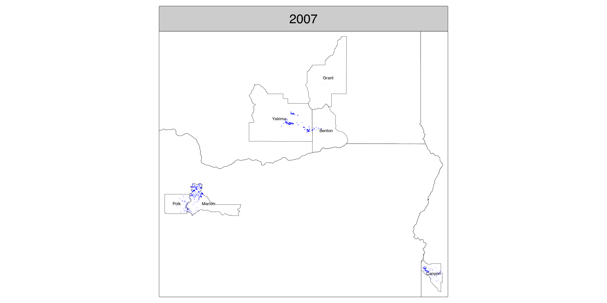

```{r knit, message=TRUE, warning=TRUE, include=FALSE}
knitr::opts_chunk$set(echo = TRUE)
```

```{r libs, message=FALSE, warning=FALSE, include=TRUE}
require(dplyr)
require(tidyr)
require(lubridate)
require(ggplot2)
require(here)
require(keyring)
require(CropScapeR) # API
require(sf)
require(terra)
require(raster)
require(tmap)
require(tigris)
require(scales)
# require(kableExtra)
require(tictoc)
require(data.table) #fwrite
require(rnassqs) # API for acreage validation
```
<a id="top"></a>
[Testing CropScape Data Layer formats](#testing-cropscape-data-layer-formats) 
with Marion County, OR

[Problem with CDL raster CRS](#problem-with-cdl-raster-crs)

[Hops growing counties in PNW](#hops-growing-counties-in-pnw)

[Examining CDL raster problems](#examining-cdl-raster-problems)

[Obtain and process rasters](#process-rasters-for-primary-hops-growing-counties)

[Data validation with NASS](#validating-cdl-data-with-nass)

[Session info and notes](#session-info-and-notes)

```{r setup, include=TRUE}
DIR_TIF <- "~/Dropbox/Data/CDL/"
FORCE_DL_TEST_TIF = TRUE
FORCE_RASTER_READ = FALSE
# archival processed data
FN_CDL_STATS <- here("cdl_stats.csv")
FN_COUNTY_STATS = here("cdl_pnw_county_stats.csv")
FN_HOP_PTS_RDATA = here("cdl_hops_points_by_year.Rdata")
# FN_HOP_DSCT_PTS_RDATA = here("cdl_hops_distinct_points")

FN_HOP_PTS_GPKG = here("cdl_hops_points_by_year.gpkg")
# I like hops but you can try other crops in this analysis
CROP_LIST <- "Hops" # use c() here to vector multiple crops
CROP_VAL <- 
  filter(linkdata, Crop %in% CROP_LIST) %>% pull(MasterCat)

# we don't need US census TIGER data until late in the script but pull it early and fail faster in case the service is down
county_boundaries <- tigris::counties(progress_bar = FALSE)
state_boundaries <- tigris::states(progress_bar = FALSE)

set.seed(250804)
tic()
```

### Testing CropScape Data Layer formats

First, we test the various CDL data products at county level to make sure we understand their formats and contents. Let's recreate the landuse table from the underlying raster data using Marion County, OR from 2020.

```{r cdl_marion_test}
TEST_FIPS = "41047"
TEST_YEAR = 2020
FN_TEST_TIF <- paste0(DIR_TIF, TEST_FIPS, "_", TEST_YEAR, ".tif")
# pull data in summary table form
testStats <- GetCDLStat(
  aoi = TEST_FIPS,
  year = TEST_YEAR,
  type = 'f',
  tol_time = 20
)

# this returns a RasterLayer object
testRast <- GetCDLData(
  aoi = TEST_FIPS,
  year = TEST_YEAR,
  type = 'f',
  format = "raster",
  # crs = "+init=epsg:4326", # allowed for input aoi but really ignored
  tol_time = 20,
  save_path = FN_TEST_TIF,
  readr = TRUE
)

terra::plot(testRast)

# save Marion Cty coordinates for future reference
mc_coords <- data.frame(raster::coordinates(testRast)
                        , Layer_1 = values(testRast)) %>%
  filter(Layer_1 >0)

# compare raster land use assignments to CDL statistics
testRast_df <- data.frame(table(values(testRast)) 
                          # Year=TEST_YEAR, FIPS=TEST_FIPS
                          ,stringsAsFactors = FALSE
)

res_m2 <- Reduce(`*`, res(testRast))
testAcreage <- left_join(testRast_df, 
                         testStats %>%
                           mutate(Value = as.factor(Value)),
                         by = c("Var1"="Value")
) %>%
    # n.b. 1 acre = 4046.856 sq-meters
    # CDL rasters can be 56x56, 30x30 or 10x10 sq-m resolution
    mutate(rastAcres = round(Freq * res_m2 /4046.856, 1)
           ,error = (1- rastAcres /Acreage))

# sample the output but include hops
testAcreage %>%
  slice_sample(n=12) %>% 
  bind_rows(filter(testAcreage, Category == "Hops")) %>%
  distinct() %>%
  arrange(Var1) # %>%
  # kbl(digits=3, booktabs=T) %>%
  # kable_classic(full_width=F) %>%
  # kable_styling(bootstrap_options = "striped")

# largest error between stats and raster reduction
max(abs(pull(testAcreage, error)), na.rm=T)
```

The errors are miniscule, so our verification checks out for this case. The raster also includes all pixels within the bounding box of the county. Note that pixels outside the county boundaries are coded 0.

### Problem with CDL raster CRS

Examining the raster header, we realize we have a problem.

```{r bad_crs_in_raster}
testRast
```

The `extent` and `crs` data are not consistent, where the crs references the Albers Equal Area (aea) projection in long/lat coordinates, but the extent is expressed in UTM without a zone reference. This mismatch will prevent us from transforming the coordinates to an alternative CRS. From the CDL FAQ: https://www.nass.usda.gov/Research_and_Science/Cropland/sarsfaqs2.php#common.2

We can correct this manually by assigning EPSG:5070, NAD83 / CONUS Albers. Then the coordinations can be transformed easily into something else, like EPSG:4326 (WGS84). I demonstrate this correction [below](#epsg-fix).

When assigning `CROP_VAL` above, I used CropScapeR's internal dataframe, `linkdata`. Many codes are not assigned to a crop or feature, and not all codes are in use for a given region in a given year. We will use the raster maps to find CDL elements coded to hops production, and find nearest climate and air quality sensors to those elements. See also https://www.nass.usda.gov/Research_and_Science/Cropland/docs/CDL_codes_names_colors.xls

### Hops growing counties in PNW

Next, we pull the CDL statistics for all PNW counties to identify those with significant acreage devoted to hops. Oregon data begin in 2007, and we don't lose much history from WA and ID by limiting our series to years in the complete OR run. See: https://www.nass.usda.gov/Research_and_Science/Cropland/metadata/meta.php

To speed successive runs, I save intermediate data for import during later knits.

```{r comprehensive_state_stats}
years <- 2007:(year(now()) -1)

# exhaust county CDL statistics by state
# FIPS is char in counties_by_state
counties_by_state <- fips_codes %>%
  filter(state %in% c("OR", "ID", "WA")) %>%
  mutate(FIPS = paste0(state_code, county_code))

if (file.exists(FN_COUNTY_STATS)) {
  cat(sprintf("Reading %s\n", FN_COUNTY_STATS))
  county_stats <- tibble(read.csv(FN_COUNTY_STATS))
} else {
  county_stats <-
    lapply(years, function(yr) {
      lapply(counties_by_state$FIPS, function(fips) {
        tmp <- GetCDLStat(
          aoi = fips,
          year = yr,
          type = 'f',
          tol_time = 20
        )
        if (is.null(ncol(tmp))) {
          tmp <- NULL
        } else {
          tmp <- 
            mutate(tmp, Year = yr, FIPS = as.character(fips))
        }
        tmp
      })
    }) %>%
    bind_rows %>%
    tibble
  fwrite(county_stats, FN_COUNTY_STATS)
}
# FIPS is int in county_stats if read from table
county_stats <- mutate(county_stats, FIPS = as.character(FIPS))

# assigned values in county_stats are not exhaustive, just 
# representative of the crop layer assignments in PNW
cdl_hops_stats <-
  county_stats %>%
  filter(Category %in% CROP_LIST) %>%
  group_by(FIPS) %>%
  summarise(MIN_AC = min(Acreage)
            ,MEAN_AC = round(mean(Acreage), 1)
            ,MAX_AC = max(Acreage)
            # simple linear growth rate
            ,MEAN_GR = round(mean(coef(lm(Acreage ~ Year))['Year']), 1)
  ) %>%
  left_join(counties_by_state, by = "FIPS") %>%
  arrange(desc(MAX_AC))
head(cdl_hops_stats, n=15)

fwrite(cdl_hops_stats, here("cdl_hops_stats.csv"))

# to focus on productive counties, we will select those with positive
# growth of at least 10 acres/yr and at least 1k acres at one time
cdl_hops_counties <- filter(cdl_hops_stats, MEAN_GR >= 10, MAX_AC >= 1000)

fwrite(cdl_hops_counties, here("cdl_hops_counties.csv"))

county_stats %>%
  filter(Category %in% CROP_LIST, 
         FIPS %in% pull(filter(cdl_hops_counties, MAX_AC >= 10), FIPS)
  ) %>%
  ggplot(aes(x=Year, y=Acreage)) +
  geom_line() + 
  facet_wrap(~ FIPS) +
  scale_x_continuous(breaks = pretty_breaks())
```

Can you spot Yakima County from this plot alone? The acreage for Yakima County, FIPS = 53077, is variable but the growth trend is unmistakeable. There are also some irregularities in the Marion County, FIPS = 41047, hops series with abrupt directional changes in 2013 and 2015. Let's look for anomalies in the underlying county raster data.

#### Anomaly detection

```{r cdl_marion_2015_test_1}
county_test <-
  county_stats %>%
  filter(FIPS %in% pull(filter(cdl_hops_counties, MAX_AC >= 10), FIPS)) %>%
  group_by(Year, FIPS) %>%
  summarise(TotAcreage = sum(Acreage)) %>%
  group_by(FIPS)

# easier to see the variation by year with log scale 
county_test %>%
  ggplot(aes(x=Year, y=TotAcreage, group=FIPS)) +
  geom_line() +
  scale_y_log10() +
  facet_wrap(~ FIPS, scales="free_y")
```

Most of the counties shown have minor fluctuations of a few acres, sometimes more, particularly at the beginning of the reporting era. This may be a consequence of early improvements in machine learning training or in training data labeling. Marion County, Oregon, FIPS=41047, however has clear outliers that we can also detect numerically by looking at a simple model for acreage growth rate over time. Units on growth rate tabulated here are avg. acres (change) per year.

### Examining CDL raster problems

```{r cdl_marion_2015_test_2a}
county_test %>%
  summarise(gr = coef(lm(TotAcreage ~ Year))['Year'])

# look for cases where total county acreage is more than 1% larger
# than the median. The outliers are 2013 and 2015...

(mc_fix <- county_test %>%
    # look for county acreage more than 1% over median
    filter(TotAcreage > 1.01 *median(TotAcreage))
)
```

In our region of interest, only two Marion County rasters are outliers, with no anomalies detected in other counties.

```{r cdl_marion_2015_test_2b}
# mc_fix_years <- pull(mc_fix, Year)

TEST_YEAR = max(mc_fix$Year) # 2015
FN_TEST_TIF <- paste0(DIR_TIF, TEST_FIPS, "_", TEST_YEAR, ".tif")
# get the 2015 data as a summary table
testStats <- GetCDLStat(
  aoi = TEST_FIPS,
  year = TEST_YEAR,
  type = 'f',
  tol_time = 20
)

testRast <- GetCDLData(
  aoi = TEST_FIPS,
  year = TEST_YEAR,
  type = 'f',
  format = "raster",
  tol_time = 20,
  save_path = FN_TEST_TIF,
  readr = TRUE
)

terra::plot(testRast)
```

Now we see that the entire bounding box for 2015 was assigned non-zero land use values, leaving points within the county boundary undifferentiated from its neighbors. We can correct this issue by creating a mask from the cooordinates correctly assigned landuse values in the 2020 Marion County data set. We can use `sf` methods but I find it faster to use dataframes made from raster extracts, then create a corrected dataset with `sf`.

```{r cdl_marion_2015_test_3}
testRast_df <- data.frame(table(values(testRast)), 
                          Year=TEST_YEAR, FIPS=TEST_FIPS
                          ,stringsAsFactors = FALSE
)

# no need to print full table
res_m2 <- Reduce(`*`, res(testRast))
left_join(testRast_df, 
          testStats %>%
            mutate(Value = as.factor(Value)),
          by = c("Var1"="Value")
) %>%
    # n.b. 1 acre = 4046.856 sq-meters
    # and raster is at 30x30 sq-m resolution
    mutate(rastAcres = round(Freq * res_m2 /4046.856, 1)
           ,error = (1- rastAcres /Acreage)) %>%
  head()

filter(testAcreage, Var1 == 0)
max(abs(pull(testAcreage, error)), na.rm=T)
```

The summary data still agrees with the raster representation, meaning that users of either the CDL raster or statistical table will see more land assigned to Marion County than possible. But the only way to correct the issue is to start from the raster. Here, I use the coordinate data from the 2020 Marion County raster to mask extraneous points during a join. The `mc_temp` assignment below is the key step to correcting the raster by eliminating any coordinates that didn't exist in the 2020 raster data.
<a id="mask-fix"></a>

```{r cdl_marion_cty_mask}
mc_2015 <- data.frame(raster::coordinates(testRast)
                      , Layer_1 = values(testRast))

# create a data frame with CDL values from both rasters using just the 2020 coordinates, previously defined in 'mc_coords'
mc_temp <- left_join(mc_coords, mc_2015, 
                      by = c("x","y"), suffix=c("_2020","_2015"))

# what proportion of points within the county boundary changed value?
mc_diff <- filter(mc_temp, Layer_1_2020 != Layer_1_2015)
(nr_temp <- nrow(mc_temp))
(nr_diff <- nrow(mc_diff))
# 30% of the points have changed since 2015...
(nr_diff /nr_temp)

# coerce the data back into a raster, keeping just the corrected 2015 layer
tic()
coordinates(mc_temp) <- ~ x + y
gridded(mc_temp) <- TRUE
crs(mc_temp) <- crs(testRast)
mc_rast <- raster::raster(mc_temp, layer=2, values=T)
toc()

# there we go
terra::plot(mc_rast)
```

### Process rasters for primary hops growing counties

Now process all raster files in `DIR_TIF` for the FIPS captured in `cdl_hops_counties`, downloading any that are missing. For now I process the files after saving them, but you may wish to do otherwise since the current set of files takes a little over 1 GB of storage. When I build `cdl_hops_point_list` below I use selectively apply coordinate masking using data assigned above. Were the problems more widespread, I would use the (e.g. `mc_fix`) to flag rasters for masking, and create its mask from a "correctly" specified raster for the given county.

```{r process_rasters}
tif_req <- expand_grid(fips=cdl_hops_counties$FIPS, years)
tif_req$filename <- with(tif_req, paste0(DIR_TIF, fips, "_", years, ".tif"))
tif_req$missing <- !file.exists(tif_req$filename)
NEW_CDL_FILES <- sum(tif_req$missing) >0

if (NEW_CDL_FILES) {
  filter(tif_req, missing) %>%
    apply(., 1, function(x) {
      # pull raster for county-year pair and save locally
      # unlike our Marion Cty tests, we don't need to read them into memory
      GetCDLData(
        aoi = x['fips'],
        year = x['years'],
        type = 'f',
        format = "raster",
        tol_time = 20,
        save_path = x['filename']
      )
    }) # next missing raster
} else  # close missing raster test
  cat("no missing rasters\n")
# all available and required rasters now locally stored

# this is the most time consuming part of the analysis
# if there are no changes to the tif_req data, and the dataframe of
# hops points by year for the required counties exists, just read
# the existing file and move on...

NEW_RASTERS <- !file.exists(FN_HOP_PTS_RDATA) & NEW_CDL_FILES

if (NEW_RASTERS | FORCE_RASTER_READ) {
  cat("restoring saved hops point data\n")
  cdl_hops_points_by_year <- readRDS(FN_HOP_PTS_RDATA)
} else {

  tic()
  cdl_hops_point_list <- 
    dir(DIR_TIF, pattern = ".tif", full.names = T) %>%
    lapply(., function(x) {
      tmpRast <- raster::raster(x) # as RasterLayer
      fips = substr(basename(x), 1,5)
      yr = as.numeric(substr(basename(x), 7,10))
      rastdf <- data.frame(raster::coordinates(tmpRast)
                           , Layer_1 = values(tmpRast)
                           , xres = xres(tmpRast)
                           , yres = yres(tmpRast)
                           , fips
                           , year = yr
      ) %>%
        # isolate the hops coordinates
        filter(Layer_1 %in% CROP_VAL)
      # apply the Marion Cty mask, this time after reducing our
      # raster data to just CROP_VAL (hops) and taking the inner join
      # to keep just the overlap among the reduced set
      if (fips == "41047" & yr %in% mc_fix$Year) {
        cat(sprintf("masking fips %s for %s\n", fips, yr))
        rastdf <- inner_join(mc_coords, rastdf, by = c("x","y"))
      }
      rastdf
    })
  toc()
  
  cdl_hops_points_by_year <- 
    bind_rows(cdl_hops_point_list)

  # too time consuming
  # cdl_hops_distinct_points <-
  #   distinct(cdl_hops_points_by_year, geometry)

  # cdl_hops_distinct_points <-
  #   Reduce(cdl_hops_point_list, function(x) distinct(x, geometry))

  saveRDS(cdl_hops_points_by_year, FN_HOP_PTS_RDATA)
  # saveRDS(cdl_hops_distinct_points, FN_HOP_DSCT_PTS_RDATA)

  file.remove(FN_HOP_PTS_GPKG)
}

# avoid the temptation to use projectRaster, transforms the Layer_1 values
# llRast <- projectRaster(testRast, crs='+proj=longlat +datum=WGS84')
# raster::plot(llRast)
```

We've processed all the data using the mismatched raster coordinates with no problems. For the volume of data, transforming coordinates early adds unnecessary computing time. Here, we have already filtered the data to isolate the landuse value of interest into a list of dataframes, and transform them directly to a simple feature using the correct CRS. 
<a id="epsg-fix"></a>

```{r write_hops_pts_gpkg}
# promote the data frame to simple feature
cdl_hops_points_by_year <- 
  # bind_rows(cdl_hops_point_list) %>%
  cdl_hops_points_by_year %>%
  # raster masks select :)
  dplyr::select(-starts_with("Layer_1.")) %>%
  # finally specifying the actual NAD UTM coordinates
  st_as_sf(coords = c("x", "y"), crs = st_crs(5070))

st_write(cdl_hops_points_by_year, FN_HOP_PTS_GPKG,
         append = F, delete_dsn = F)
```

```{r eval=FALSE, include=FALSE}
tic()
# this finds coords that have been assigned as hops even once
# finding distinct points is much MUCH faster in UTM
cdl_hops_points_distinct <- 
  cdl_hops_points_by_year %>%
  dplyr::select(-year) %>%
  distinct(geometry, .keep_all = T) %>%
  st_transform(crs = 4326)
toc()

st_write(cdl_hops_points_distinct, 
         here("cdl_hops_points_distinct.gpkg"), 
         append = F, delete_dsn = F)
```

We can also illustrate the variation in hops landuse assignments in the CDL methodology over time.

```{r anim_map, eval=NEW_RASTERS, include=TRUE}
hops_geo <-
  left_join(
    cdl_hops_counties
    ,county_boundaries
    ,by=c("FIPS"="GEOID")) %>%
  st_as_sf()

hops_points <- 
  cdl_hops_points_by_year %>%
  st_transform(crs = 4326)
  
hops_animation <- 
  tm_shape(hops_geo) +
  tm_borders() +
  tm_text('NAME') +
  tm_shape(state_boundaries) +
  tm_borders() +
  tm_shape(hops_points) +
  tm_dots(
    col = "Layer_1",
    fill = 'blue',
    size = 0.05,
    fill_alpha = 0.2
    ) +
  tm_facets(pages = "year") +
  tm_layout(legend.show = F, 
            panel.label.size=3, panel.label.height=5) 
  # tm_layout(legend.position = c("left", "bottom")) 

tmap_animation(
  hops_animation, filename = "hops_points.gif",
  delay = 50, width = 2400, height = 1200
)
```



### Validating CDL data with NASS

We can attempt to validate the CDL acreage assignments with NASS data. From previous experience we know that while the NASS census reporting (collected every 5 years) captures county level statistics, the reporting can be very incomplete. We will attempt instead to validate the CDL assignments at state level by year against the NASS survey data, already aggregated by state.

```{r validate_with_nass_census}
key_get("NASS") %>%
  nassqs_auth()

nass_survey_hops <- nassqs(
  source_desc = "SURVEY"
  ,class_desc = "ALL CLASSES"
  ,agg_level_desc = "STATE"
  ,sector_desc = "CROPS"
  ,commodity_desc = "HOPS"
  ,statisticcat_desc = "AREA HARVESTED"
  ,year__GE = min(years)
  ,reference_period_desc = "YEAR"
  ,unit_desc = "ACRES"
  ,progress_bar = FALSE
)

# trying to avoid the bounding box problem by pulling land use
# at state level instead of aggregating up from county level
# must request them one at a time
state_codes <- pull(cdl_hops_counties, state_code) %>% unique
cdl_state_acreage <- lapply(state_codes, function(fips) {
  lapply(years, function(yr) {
    GetCDLStat(
      aoi = fips,
      year = yr,
      type = 'f',
      tol_time = 20
    ) %>%
      mutate(state_code = fips,
             year = yr)
  })
})

cdl_hops_area <- bind_rows(cdl_state_acreage) %>%
  filter(Category %in% CROP_LIST)

acreage_val <- left_join(
# select NASS fields before joining
  dplyr::select(nass_survey_hops, state_fips_code, year, Acreage=Value) %>% mutate(year = as.numeric(year)),
  dplyr::select(cdl_hops_area, -Value), # avoid confusing label
  by = c("state_fips_code"="state_code", "year"),
  suffix = c("_nass", "_cdl")
) %>%
  mutate(Acreage_err = Acreage_cdl - Acreage_nass, # diff relative to NASS as reference
         Acreage_perc_err = Acreage_err /Acreage_nass *100)
```

There is one wild outlier in Oregon. Recall 2013 was one of two instances of bad statistics derived from land use assignments filling the Marion county bounding box. Maybe this problem is or was more widespread for Oregon in 2013. But errors for the other "unmasked Marion" year, 2015, were comparable to those we see elsewhere in the data. I won't investigate
the issue further in this document.

```{r valdn_outlier}
(filter(acreage_val, abs(Acreage_perc_err) >100) )
```

The remaining validation errors are less extreme.

```{r valdn_okay}
# the remainder of the pct error has this distribution
filter(acreage_val, abs(Acreage_perc_err) <=100) %>%
  with(., hist(Acreage_perc_err, xlim = c(-100,100)))
```

We can't verify the CDL assignments this way, since the absolute errors are so large. It is possible though that, for the purpose of identifying what counties dedicate the largest acreage to hops production, the two datasets are nevertheless consistent. NASS census data are not easy to use in analyses, this is my best attempt so far to pull insight from them.

```{r compare_cty_ranks}
nass_census_hops <- nassqs(
  agg_level_desc = "COUNTY"
  ,source_desc = "CENSUS"
  ,state_alpha = c("OR","WA","ID")
  ,commodity_desc = "HOPS"
  ,statisticcat_desc = "AREA HARVESTED"
  ,unit_desc = "ACRES"
  ,short_desc = "HOPS - ACRES HARVESTED"
  ,progress_bar = FALSE
)

census_yrs <- pull(nass_census_hops, year) %>% unique
earliest_census <- min(census_yrs)
latest_census <- max(census_yrs)
prior_census <- max(census_yrs[-which.max(census_yrs)])

(nass_ranks <-
    nass_census_hops %>%
    filter( 
      statisticcat_desc == "AREA HARVESTED",
      unit_desc == "ACRES",
      short_desc == "HOPS - ACRES HARVESTED",
      domain_desc == "TOTAL") %>%
    mutate(Value = as.numeric(Value)
           ,FIPS = paste0(state_fips_code, county_code)) %>%
    # dplyr::select(state_name, county_name, year, Value) %>% 
    arrange(state_name, county_name, year) %>%
    pivot_wider(id_cols = c(state_name, county_name, FIPS), 
                names_from = year,
                values_from = Value) %>%
    # NA are unreported values, not just a rounded zero
    # ungroup %>%
    arrange(desc(!!sym(latest_census)), desc(!!sym(prior_census))) %>%
    mutate(rank = row_number()) %>%
    dplyr::select(-state_name) %>%
    pivot_longer(where(is.double), names_to = "year", 
                 values_to = "acres") %>%
    filter(!is.na(acres)) %>%
    group_by(FIPS, rank) %>%
    summarise(MEAN_AC = mean(acres, na.rm=T),
              MAX_AC = max(acres, na.rm=T)) %>%
    arrange(rank)
)

(cdl_ranks <- 
    cdl_hops_stats %>%
    mutate(rank = row_number(),
           county = gsub(" County", "", county)) %>%
    dplyr::select(-starts_with("state"),
                  -starts_with("county"), -MIN_AC, state, county)
)

all_ranked <- left_join(cdl_ranks, nass_ranks,
                        by="FIPS", suffix=c("_CDL", "_NASS"))

filter(all_ranked, !is.na(rank_NASS) | rank_CDL <10)
```

Comparing rankings among the two data sets, the most convincing overlap includes just Yakima and Benton Counties in WA, and Marion County, OR. Other Oregon and Washington counties ranked by NASS analysis fall well outside the CDL top 10. Idaho does not participate in the NASS census, but CDL identifies Canyon County, ID as having the largest hop acreage in the state. 

We have a lot of flexibility about choosing counties to contrain the choice of environmental sampling locations for modeling and analysis. We also have enough information about likely hops acreage within selected counties to try localizing environmental sampling. It is enough for now to simply take the top four CDL ranked counties. This gives us the largest hops producing counties in the PNW with representation from each state, excepting corroboration of Canyon County, ID with NASS. After excluding negative growth rate, `MEAN_GR`, we might be willing to consider lower ranked counties as well. 

Here is our final list:

```{r final_list}
(dplyr::select(cdl_hops_counties, -ends_with("_code")))
toc()
```

### Session info and notes

```{r end}
sessionInfo()
```

#### TO DO

Write logic to avoid downloading TIFs unnecessarily by testing for saved `cdl_hops_points_by_year.gpkg` as a starting point for `tif_req`

Generalize the test of "bad bounding box" TIFs when processing all rasters

Extend the NASS validation attempt to look for trends in errors by state over time. The current analysis aggregates the distribution of errors over all years and states, but we can also test whether discrepancies are declining (or growing) over time.

<!-- Replace `nass_county_test` with a NASS census call, with all its problems -->

<!-- Modify hardcoded most recent data year from 2024 to calculated previous year from current -->

<!-- Add logic to avoid re-processing previously saved rasters by reading from previously saved hops gis data instead -->

[Return to top](#top)
