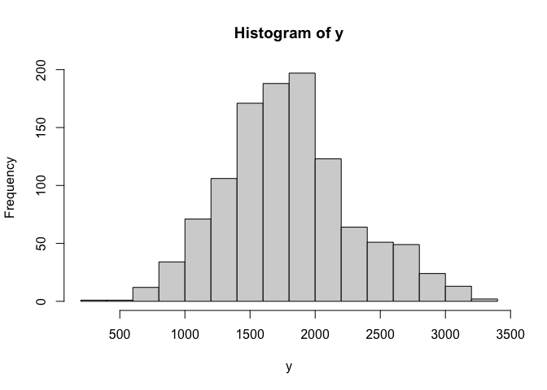
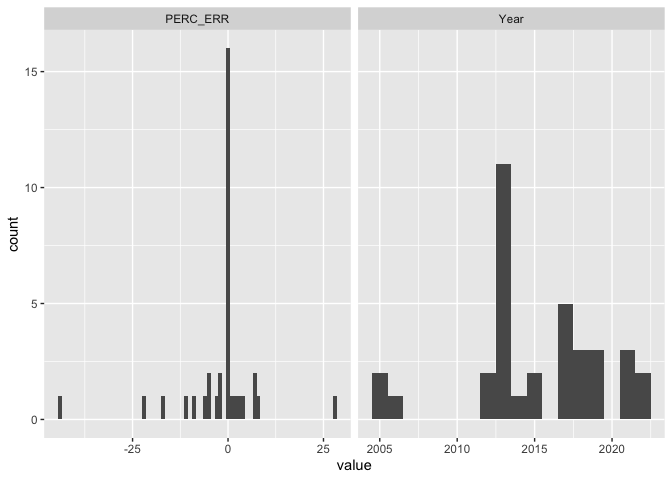
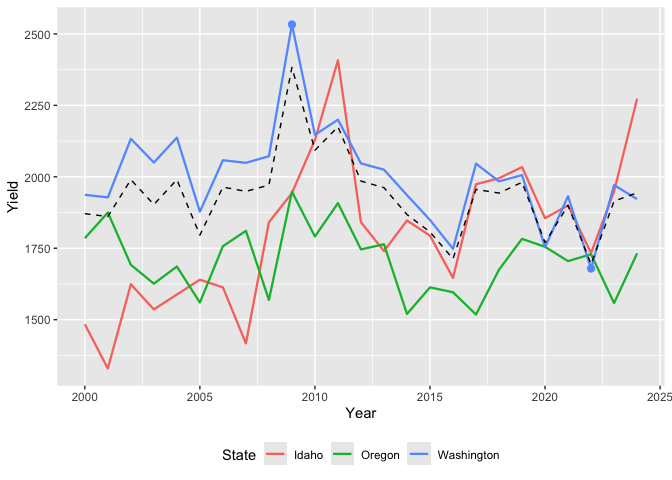
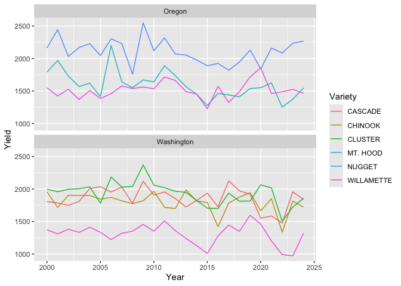

HGA data for Analysis of Hops Yield
================
Don A. Lloyd

Updated 23 November, 2025

<a name="top"></a> Keywords: hops, yields, data extraction, data
cleansing, data validation, regex, outlier analysis

[Extracting](#extracting-hop-yields-from-hga) and
[cleaning](#data-cleaning) hop yields from HGA reports

[Validating the yield data with
NASS](#validating-the-hga-yield-data-with-nass) including [internal
checks](#validate-nass-internal-reporting)

<!-- [GO TO WORK IN PROGRESS](#in-progress-data-checks) -->

[Finalizing the yield dataset](#finalizing-the-yield-dataset)

<!-- outlier tests, continuity checks -->

[Preliminary analysis of hops
yields](#preliminary-analysis-of-hop-yield-series) including
[outliers](#outliers) and series [continuity](#continuity)

Write the [final yields](#final-yields)
<!-- and demonstrate basic [stationarity tests](#stationarity-tests) of the series -->

[Summary](#summary) and some [challenges](#challenges-with-yield-data)

[Session info](#session-info-and-notes)

``` r
require(here)
require(tictoc)
require(dplyr)
require(stringr)
require(tidyr)
require(tibble)
require(pdftools)
require(ggplot2)
require(tseries)
require(data.table) # fwrite
require(lubridate) # today
require(keyring)
require(rnassqs) # NASS API
```

``` r
HGA_VERBOSE = FALSE
HGA_DATA_PATH = "~/Dropbox/Data/HGA"
```

## Extracting hop yields from HGA

In 2020, wildfires caused extensive smoke damage to crop harvests in and
around Oregon’s Willamette River Valley. The smoke damage to wine grapes
were widely reported. But, I enjoy a good IPA more often than a good
pinot so I became interested in how hops harvests were impacted by the
wildfires. The number and severity of wildfires in the Willamette Valley
that year was worsened by high temperatures and dry conditions. I began
looking for hops cultivation data to understand several questions:

- Do we see evidence that hop yields negatively impacted in 2020?

- What environmental observations – if any – correlate with yields or
  changes in yields?

- Are some hops varieties or growing regions more or less susceptible to
  changes in environmental variables?

The overall strategy for conducting this analysis has been to compile
climate and air quality data for areas in the PNW that grow hops.
Sourcing and processing of environmental data, and finding hop
cultivating areas are described in other scripts.

To begin the analysis, I compiled hops yield data from statistical
reports published annually by the [Hop Growers of
America](https://usahops.org) since 2000. I wrote much of the scripting
in this document to process the reports by identifying and parsing the
yield tables from each pdf and correct transcription issues.

I then used the [National Agricultural Statistics
Service](https://nass.usda.gov) (NASS) to validate my transcription of
the data and update missing values. NASS is an excellent source of
agricultural data in the US but it lacks hops reporting by variety
before 2013. Validating against NASS was a very useful exercise for
improving data cleaning in my pdf processing.

The yield tables include annual yields by variety and state, and summary
values by state, region, and or as national measures. None of the
available yield data provide subtotals by county in which hops were
grown.

I am using the HGA yield values when first published, not most recently
published. Each HGA table also reports several prior year’s values to
indicate changes in reporting and recent trends. Values from later
reports for a given year could be used to test for changes in reporting,
for example to revise a previously published value.

This script produces three csv files reporting hops yields in three
levels of granularity: within the PNW region, by state within the PNW,
and by variety within each state. Each file reports Year, Yield, and
data Source. State and variety labels are included in the respective
files. Outlying values in each data set are identified with dummy
variables.

The script also produces a csv of validation data from NASS, and a table
of reporting continuity for varieties grown in each state.

You can download the data files from this git and get on with your own
analysis. If you choose to download the PDFs from HGA just save them in
a directory of their own and define the full `HGA_DATA_PATH`.

### PDF processing

``` r
# this relies on lots of regex to find and parse yield tables that
# appear on different pages of each annual report. there are lots of
# issues to work around in these reports including changing headers,
# misplaced labels, tables split across multiple pages, footnote markers
# embedded in labels, variable spacing of raw table data, and 
# inconsistent labeling in different reports...
# use HGA_VERBOSE=TRUE for debugging 
#
pdf.list <- dir(HGA_DATA_PATH, pattern = ".pdf", ignore.case = TRUE, full.names = TRUE)

tic() # for the curious
# read each report, find the yield table and extract it
listtbl <- lapply(pdf.list, function(x) {
  if (HGA_VERBOSE) cat(sprintf("processing %s\n", basename(x)))
  rawtext <- pdf_text(x) %>% str_split("\n")
  singlepage <- lapply(rawtext, function(x) Reduce(c, x))
  # find header lines
  hp <- grep("[[:digit:]]{4} Statistical .*", singlepage)
  hl <- grep("[[:digit:]]{4} Statistical .*", singlepage[[min(hp)]])
  # extract the reporting year
  year <- as.numeric(gsub(".*[ ]+([[:digit:]]{4}) Statistical .*", "\\1", 
                          grep("[[:digit:]]{4} Statistical .*", singlepage[[min(hp)]], value = TRUE)
  ))
  out <- NULL
  # recent reports refer to "PNW HOP YIELDS", older reports use "U.S. HOP YIELDS"...
  ii <- grep("HOP YIELDS BY STATE", singlepage, ignore.case = TRUE)
  # find page in report that includes the current yield table by variety
  toc <- grep("HOP YIELDS.*VARIETY", unlist(singlepage[ii[1]]), ignore.case = TRUE, value = TRUE)
  pptxt <- gsub(".* ([0-9\\-]+)$", "\\1", toc)
  if (grepl("\\-", pptxt)) pptxt <- unlist(strsplit(pptxt, "\\-"))
  # can test if pp is defined
  pp <- as.numeric(pptxt)
  # isolate page numbers
  pagenumtarget = "[[:space:]]{5,}([[:digit:]ivx]+).*"
  pagenum <- sapply(1:length(singlepage), function(x) {
    pagerows <- grep(pagenumtarget, singlepage[[x]])
    if (length(pagerows) >0) {
      thispage <- max(pagerows)
      gsub(pagenumtarget, "\\1", singlepage[[x]][thispage])
    }
  })
  pp <- as.numeric(match(pptxt, pagenum))
  o <- trimws(unlist(singlepage[pp]))
  # A few files will add breaks before and or after TM labels in Variety names
  # sometimes leaving a row of numbers with no leading Variety name. We look
  # for the missing data in lines immediately preceding or following each row
  # missing a hop variety.
  # let's first eliminate "Hop Grower" lines
  o <- grep("^Hop Growers", o, invert = TRUE, value = TRUE)
  # then drop rows that are at least 5 char all caps (typically state names and some headings)
  o <- grep("^[[:upper:]]{5,}$", o, invert = TRUE, value = TRUE)
  # look for rows that start with a numeric (e.g. yield) entry that are otherwise complete
  # these rows are missing a variety entry
  # this is a little cumbersome, but better than other methods I have tried...
  ifloat <- which(grepl("^[0-9,]{3,}|^TM[ ]+|^[12]{1}[ ]*", o) & nchar(o) >30)
  if (length(ifloat) >0) {
    if (HGA_VERBOSE) {
      cat("these rows appear to be missing variety labels\n")
      print(ifloat)
    }
    # check previous 2 rows for varietal label that got left behind
    for (i in ifloat) {
      if (HGA_VERBOSE) cat(sprintf("checking line %d:\n%s\n", i, o[i]))
      ivar <- c(i-2, i-1)
      # in rare cases the pdf publishing software will format the
      # variety label by shifting it up or down one row, so let's fix it
      # the logic is a little pedantic, but easy enough to read
      if (match(i, ifloat) < length(ifloat)) {
        ok <- (i+1 < ifloat[match(i, ifloat) +1] -2)
      } else {
        ok <- (i+1 < length(o))
      }
      if (ok) ivar <- c(ivar, i+1)
      if (HGA_VERBOSE) print(o[sort(c(ivar,i))])
      ii <- which(nchar(o[ivar]) <16)
      if (length(ii) >0) {
        # replace corrected line using wide space so it parses with remainder of table
        # n.b. the partial lines we built labels from won't be parsed below...
        if (HGA_VERBOSE) cat(sprintf("proposed label: %s\n", paste(o[ivar[ii]], collapse = " ")))
        o[i] <- paste(paste(o[ivar[ii]], collapse = " "), o[i], sep = "          ")
        if (HGA_VERBOSE) print(o[i])
      } else {if (HGA_VERBOSE) cat("no label text found...\n")}
    } 
  } # closes loop for missing label search
  # find rows that conform to a table definition
  rawtbl <- grep("([0-9,\\.]+|[\\*]){3,}", o, value = TRUE) %>%
    # replace blank space with a delimiter unique to the table
    gsub("[[:space:]]{2,}", "|", .) %>% 
    gsub(",|%", "", .) %>% # drop comma and percentage formatting
    # next line partially fixes issues with extra spaces or footnote labels in first col
    gsub("([[:alpha:] \\!]+)\\|([[:alpha:] ]+|[123]?\\|.*)", "\\1 \\2", .)
  tblrows <- grep("\\|", rawtbl) # keep only lines we can parse
  rawtbl <- rawtbl[tblrows]
  # find header row
  h <- grep("Variety", rawtbl, ignore.case = TRUE)
  # header may be duplicated if table continues on second page
  # find start of next table
  h1 <- min(h)
  # n.b. this header appears to be consistent across the reports
  hdr <- unlist(strsplit(rawtbl[h1], split = "\\|"))
  # if there are three or more header rows with a split table, assume
  # they mark new tables that can be dropped...
  hh <- ifelse(length(h) >2, h[3] - 1, length(rawtbl))
  rawtbl <- rawtbl[1:hh] # dropping extra rows
  # eliminate stray headers
  rawtbl <- grep("& Variety", rawtbl, ignore.case = TRUE, value = TRUE, invert = TRUE)
  # ready to parse what is left
  # read.table orig. had skip = h1, error caused us to skip several years of
  # single line Idaho reporting...
  parsedtbl <- read.table(text = rawtbl, skip = 1, sep = "|", fill = TRUE,
                          na.strings = c("*"), row.names = NULL,
                          col.names = hdr) %>%
    as_tibble %>%
    select(1, all_of(paste0("X", year))) %>%
    rename(Variety = 1, Yield = 2) %>%
    mutate(Yield = ifelse(grepl("[^[:digit:]]", Yield), NA, Yield)
           ,Yield = as.numeric(Yield)
           ,Year = year
           ,isTotal = grepl("Total", Variety)
           ,Variety = gsub("Total Idaho[ ]*1", "Total Idaho", Variety)
           ,State = ifelse(isTotal, trimws(gsub("Total", "", Variety)), NA)
           ,Source = paste("HGA", basename(x))
    ) %>%
    fill(State, .direction = "up")
  list(file = basename(x), tbl = parsedtbl, year = year, 
       raw = rawtbl, o = o)
}) # next file
toc()
```

    ## 4.424 sec elapsed

``` r
hga_years <- unlist(lapply(listtbl, function(x) x$year))
listtbl <- setNames(listtbl, hga_years)

# save the years of yield reporting to correctly bound
# climate and air data sets later on
# fwrite(data.frame(years = sort(years)), file = here("HGA_years.csv"))
```

The main disadvantage of compiling the first reported yield for each
variety or aggregate is that we can overlook subsequent revisions to the
reporting. Inspection of consecutive reports shows that yields can be
revised later, usually in the next year. Many yields that are later
corrected may be preliminary estimates.

[Back to top](#top)

### Data cleaning

Cleanup on names seems self evident to me, but for background and
explanatory info see:
<https://en.wikipedia.org/wiki/List_of_hop_varieties>

For naming conventions see <https://www.hopslist.com/hops/>

Abbreviations for some of the major hop breeders:

- YCR = Yakima Chief Ranches, consortium of family hop farms, Yakima, WA
- HBC = Hop Breeding Company, a joint venture of YCR and Haas
- VGX = Virgil Gamache Farms, Toppenish, WA
- ADHA = Association for the Development of Hop Agronomy (www.adha.us)

*Some variety names are trademarked.* I have attempted to capture the
trademark status while parsing the HGA reports.

``` r
# process each table, clean and parse variety names
# I do attempt to preserve TM and R notations...
hga_yield <- 
  lapply(listtbl, function(x) x$tbl) %>% 
  bind_rows() %>%
  filter(!str_detect(Variety, "TATE")) %>%
  # the 2012 report does not include the total rows for WA or US/PNW
  mutate(State = ifelse(is.na(State) & Year == 2012, "Washington", State)
         ,isTM = grepl("TM|T M|\\x99", Variety) # trademark
         ,isR = grepl(" R|R |\\xAE", Variety) # registered trademark
         # eliminate commas, parentheses and symbols from variety names
         ,Variety = gsub(",|\\(|\\)|TM|T M|\\x99|\\xAE|\\*", "", Variety)
         ,Variety = trimws(Variety) # clean up trailing spaces after symbol pass
         # ,Variety = gsub(",|\\(|\\)|TM|T M| R|R |\\x99|\\xAE", "", Variety)
         # contract multiple spaces
         ,Variety = gsub("[[:space:]]{2,}", " ", Variety)
         # eliminate strays spaces within variety names
         ,Variety = gsub("([[:alpha:]]+)[[:space:]]+([[:lower:]]+.*)", "\\1\\2", Variety)
         # drop subscripts from total and aggregate lines
         ,Variety = gsub("(Total|Other [A-Za-z]+)[ ]*[12]$", "\\1", Variety)
         # drop -er from Hallertauer, see NASS labels
         # ,Variety = gsub("Hallertauer", "Hallertau", Variety)
         ,Variety = gsub("Calyp so", "Calypso", Variety) # unusual space
         # standardize variety names to correct some inconsistencies 
         # but also make them more consistent with NASS during validation
         ,Variety = case_when(
           grepl("YCR[ ]*4|Palisade", Variety) ~ "Palisade YCR 4"
           ,grepl("YCR[ ]*5|Warrior", Variety) ~ "Warrior YCR 5"
           ,grepl("Super[ ]*Galena", Variety) ~ "Super Galena"
           ,grepl("Talus|692", Variety) ~ "Talus HBC 692"
           ,grepl("Summit", Variety) ~ "Summit"
           ,grepl("Ahtanum|YCR 1$", Variety) ~ "Ahtanum YCR 1"
           ,grepl("ADHA-483|Azacca", Variety) ~ "Azacca ADHA-483"
           ,grepl("ADHA-881|Jarrylo", Variety) ~ "Jarrylo ADHA-881"
           ,grepl("Pekko|ADHA-871", Variety) ~ "Pekko ADHA-871"
           ,grepl("Citra|HBC 394", Variety) ~ "Citra HBC 394"
           ,grepl("Tettnang", Variety) ~ "Tettnanger"
           ,grepl("Loral|HBC 291", Variety) ~ "Loral HBC 291"
           ,grepl("Simcoe|YCR 14", Variety) ~ "Simcoe YCR 14"
           # Hallertau Magnum was reported as Magnum from 2012-2018
           # but review of HGA yield tables show their equivalence
           # n.b. Hallertau Magnum and Hallertauer are reported as distinct varieties
           #,grepl("Magnum", Variety) ~ "Hallertau Magnum"
           ,TRUE ~ Variety
         ) 
  )

fwrite(hga_yield, here("hga_yield.csv"))

# hga_yield table retains "Other" varieties and totals
(hga_varieties <- 
    hga_yield %>%
    pull(Variety) %>%
    sort %>%
    unique
)
```

    ##  [1] "Ahtanum YCR 1"           "Alpha"                  
    ##  [3] "Amarillo VGXP01"         "Apollo"                 
    ##  [5] "Aroma"                   "Azacca ADHA-483"        
    ##  [7] "Bravo"                   "Calypso"                
    ##  [9] "Cascade"                 "Cashmere"               
    ## [11] "Centennial"              "Chelan"                 
    ## [13] "Chinook"                 "Citra HBC 394"          
    ## [15] "Cluster"                 "Columbus/Tomahawk"      
    ## [17] "Columbus/Tomahawk/Zeus"  "Comet"                  
    ## [19] "Crystal"                 "Ekuanot HBC 366"        
    ## [21] "El Dorado"               "Eroica"                 
    ## [23] "Eureka!"                 "Experimental"           
    ## [25] "Fuggle"                  "Galena"                 
    ## [27] "Glacier"                 "Golding"                
    ## [29] "Hallertau Magnum"        "Hallertauer"            
    ## [31] "High Alpha"              "Horizon"                
    ## [33] "Idaho 7"                 "Jarrylo ADHA-881"       
    ## [35] "Liberty"                 "Loral HBC 291"          
    ## [37] "Magnum"                  "Millennium"             
    ## [39] "Mosaic HBC 369"          "Mt. Hood"               
    ## [41] "Mt. Rainier"             "Northern Brewer"        
    ## [43] "Nugget"                  "Olympic"                
    ## [45] "Other"                   "Other Alpha"            
    ## [47] "Other Aroma"             "Other Varieties"        
    ## [49] "Pahto HBC 682"           "Palisade YCR 4"         
    ## [51] "Pekko ADHA-871"          "Perle"                  
    ## [53] "Saaz"                    "Sabro HBC 438"          
    ## [55] "Santiam"                 "Simcoe YCR 14"          
    ## [57] "Sorachi Ace"             "Sterling"               
    ## [59] "Strata OR 91331"         "Summit"                 
    ## [61] "Super Galena"            "Tahoma"                 
    ## [63] "Talus HBC 692"           "Tettnanger"             
    ## [65] "Tillicum"                "Total Idaho"            
    ## [67] "Total Oregon"            "Total Pacific Northwest"
    ## [69] "Total United States"     "Total Washington"       
    ## [71] "Triumph"                 "Vanguard"               
    ## [73] "Warrior YCR 5"           "Willamette"             
    ## [75] "Zappa"                   "Zeus"

Get our bearings for what typical yield values (lb/acre) we should
expect. I am leaving in the aggregations for state and region with
individual varieties to get a ballpark figure over the entire reporting
period. Yields of 1500-2000 lb/acre are typical.

We should also note that we have over 200 missing yields transcribed
from the HGA reports. These are anonymized values to protect the privacy
of growers that are cultivating unique varieties within their state.

``` r
y <- hga_yield$Yield
summary(y)
```

    ##    Min. 1st Qu.  Median    Mean 3rd Qu.    Max.    NA's 
    ##     365    1468    1772    1798    2072    3387     273

``` r
hist(y)
```

<!-- -->

UPDATE

The missing national and WA aggregate yields from 2012 are truly missing
from the HGA data, not merely skipped in our processing. Add the
records, label their source, and illustrate the results. We then subset
and save the yield tables into state and regional summaries, and
varietal yields by state.

[Back to top](#top)

## Validating the HGA yield data with NASS

To validate, we can retrieve hops yields from the National Agriculture
Statistics Server (NASS). This pulls all hops data that will overlap the
our HGA reporting years, up to the current year. Since hops are
harvested once per year, statistics reported for the current year are
usually incomplete before December.

The data returned includes yields (lbs/acre), harvested acres, and
production in pounds. The data also includes production measured in
dollars and many categorical factors that are not immediately relevant
to this analysis.

``` r
key_get("NASS") %>%
  nassqs_auth()

# n.b. can't yet select on prodn_practice_desc
nass_all <- nassqs(
  source_desc = "SURVEY"
  ,sector_desc = "CROPS"
  ,commodity_desc = "HOPS"
  ,year__GE = min(hga_years) # 20250826 updated API
  # adding a second constraint on year doesn't seem to work
  #,year__LT = year(today()) 
  ,reference_period_desc = "YEAR"
  ,progress_bar = FALSE
) %>%
  # exclude current year, assume its reporting is incomplete
  # yields and other data are not usually finalized until December
  filter(as.numeric(year) < year(today()))

fwrite(nass_all, file = "nass_all_data.csv")
```

### Validate NASS internal reporting

We can start by testing whether the NASS yields are internally
consistent with the corresponding production and acreage values. After
isolating production and area in the correct units, we can calculate the
yields from their ratio and look for discrepancies with the reported
yields.

``` r
nass_internal_validation <-
  nass_all %>%
  # prodn_practice_desc now tracks ORGANIC as a subset of production
  filter(prodn_practice_desc != "ORGANIC") %>% # we want totals regardless of production practice
  filter((statisticcat_desc == "YIELD" & unit_desc == "LB / ACRE") | 
           (statisticcat_desc == "PRODUCTION" & unit_desc == "LB") |
           (statisticcat_desc == "AREA HARVESTED" & unit_desc == "ACRES")
  ) %>%
  pivot_wider(id_cols = c("state_name", "class_desc", "year"), 
              names_from = "statisticcat_desc", values_from = "Value") %>%
  filter(!is.na(YIELD)) %>%
  mutate(`YLD CALC` = round(PRODUCTION /`AREA HARVESTED`, 0)
         ,ERR = `YLD CALC` -YIELD
         ,PERC_ERR = ERR /YIELD *100)

# we will ignore rounding errors of +/- 1 lb/acre
filter(nass_internal_validation, abs(ERR) >1) %>%
  rename(ACRES = `AREA HARVESTED`) %>%
  arrange(desc(abs(ERR)))
```

    ## # A tibble: 5 × 9
    ##   state_name class_desc   year  ACRES PRODUCTION YIELD `YLD CALC`   ERR PERC_ERR
    ##   <chr>      <chr>        <chr> <dbl>      <dbl> <dbl>      <dbl> <dbl>    <dbl>
    ## 1 OREGON     OTHER VARIE… 2021    604      1075.  1780          2 -1778 -99.9   
    ## 2 IDAHO      OTHER VARIE… 2021    850      1466.  1725          2 -1723 -99.9   
    ## 3 OREGON     OTHER VARIE… 2022    586       935.  1595          2 -1593 -99.9   
    ## 4 IDAHO      ELANI TM YQ… 2023      8      9300   1158       1162     4   0.345 
    ## 5 IDAHO      ELANI TM YQ… 2024      8     21400   2673       2675     2   0.0748

There are two very minor errors (\< 1%) that we will ignore by
preferring the reported yield over the calculation. The other errors are
quite large and difficult to diagnose for the “OTHER VARIETIES” label.
The errors are most likely a consequence of the aggregation or
incomplete reporting of harvested acres. Whatever the source, the
calculated yields are obvious departures from the ranges we might expect
from our summary of HGA data, and we will use the reported yields for
each discrepant case.

``` r
# annual yields by state per NASS
# class_desc distinguishes yields are aggregated over variety by region
# class_desc == "ALL CLASSES" are state/PNW/US totals
# class_desc != "ALL CLASSES" are varietal yields

nass_yield <- 
  nass_all %>%
  tibble %>%
  mutate(Year = as.numeric(year)) %>%
  filter(statisticcat_desc == "YIELD"
         #,class_desc != "ALL CLASSES"
         ,prodn_practice_desc != "ORGANIC"
  ) %>%
  select(class_desc, Value, Year, state_name) %>%
  mutate(Yield = ifelse(grepl("\\(D\\)", Value), NA, gsub(",", "", Value))
         ,Yield = as.numeric(Yield)
         ,Variety = gsub(",| TM| R[^[:upper:]]| R$", "", class_desc)
         ,Variety = case_when(
           Variety == "MILLENIUM" ~ "MILLENNIUM" # fix persistent NASS typo
           ,grepl("HBC 682", Variety) ~ "PAHTO HBC 682" # NASS doesn't use Pahto name
           # ,grepl("C/T/Z", Variety) ~ "COLUMBUS/TOMAHAWK" # HGA still use C/T label (16 June 24) -- will reconcile this below
           ,grepl("SABROHBC 438", Variety) ~ "SABRO HBC 438" # typo (16 June 24)
           # next line formerly known as X-331 from an OR exp. hop field
           ,grepl("STRATAOR91331", Variety) ~ "STRATA OR 91331" # (5 Sep 25 expand collapsed text)
           ,TRUE ~ Variety
         )
         ,State = str_to_title(state_name)
  ) %>%
  select(Variety, Yield, Year, State) %>% 
  arrange(Year, State)

(nass_varieties <- 
    nass_yield %>%
    pull(Variety) %>%
    sort %>%
    unique
)
```

    ##  [1] "AHTANUM YCR 1"            "ALL CLASSES"             
    ##  [3] "ALTUS"                    "AMARILLO VGXP01"         
    ##  [5] "APOLLO"                   "AZACCA ADHA-483"         
    ##  [7] "BITTER GOLD"              "BRAVO"                   
    ##  [9] "BULLION"                  "C/T/Z"                   
    ## [11] "CALYPSO"                  "CASCADE"                 
    ## [13] "CASHMERE"                 "CENTENNIAL"              
    ## [15] "CHINOOK"                  "CITRA HBC 394"           
    ## [17] "CLUSTER"                  "COMET"                   
    ## [19] "CRYSTAL"                  "DELTA"                   
    ## [21] "EKUANOT HBC 366"          "EL DORADO"               
    ## [23] "ELANI YQH 1320"           "EUREKA!"                 
    ## [25] "EXPERIMENTAL"             "FUGGLE"                  
    ## [27] "GALENA"                   "GLACIER"                 
    ## [29] "GOLDING"                  "HALLERTAUER MAGNUM"      
    ## [31] "HALLERTAUER MITTELFRUHER" "HELIOS HS15619"          
    ## [33] "HORIZON"                  "IDAHO 7"                 
    ## [35] "IDAHO GEM"                "JARRYLO ADHA-881"        
    ## [37] "LEMONDROP"                "LIBERTY"                 
    ## [39] "LORAL HBC 291"            "LOTUS"                   
    ## [41] "MCKENZIE C 148"           "MERIDIAN"                
    ## [43] "MILLENNIUM"               "MOSAIC HBC 369"          
    ## [45] "MT. HOOD"                 "MT. RAINIER"             
    ## [47] "NORTHERN BREWER"          "NUGGET"                  
    ## [49] "OTHER VARIETIES"          "PAHTO HBC 682"           
    ## [51] "PALISADE YCR 4"           "PEKKO ADHA-871"          
    ## [53] "PERLE"                    "SAAZ"                    
    ## [55] "SABRO HBC 438"            "SIMCOE YCR 14"           
    ## [57] "SORACHI ACE"              "STERLING"                
    ## [59] "STRATA OR 91331"          "SULTANA"                 
    ## [61] "SUMMIT"                   "SUPER GALENA"            
    ## [63] "TAHOMA"                   "TALUS HBC 692"           
    ## [65] "TETTNANGER"               "TRIUMPH"                 
    ## [67] "VANGUARD"                 "WARRIOR YCR 5"           
    ## [69] "WILLAMETTE"               "ZAPPA"                   
    ## [71] "ZEUS"

``` r
fwrite(nass_yield, file = "nass_yield.csv")
```

[Back to top](#top)

## Finalizing the yield dataset

We have already standardized variety names *within* each data set, but
before combining data we should examine mismatched labels across the two
data sets. As an aside, I found that investigating discrepancies between
HGA and NASS was very instructive for troubleshooting pdf processing
errors, and surfaced some curious issues with the 2013 reporting.

``` r
var_hga <- pull(hga_yield, Variety) %>% unique %>% toupper # %>% sort
var_nass <- pull(nass_yield, Variety) %>% unique # %>% sort

# varieties in NASS not found in HGA
setdiff(var_nass, var_hga) %>% sort
```

    ##  [1] "ALL CLASSES"              "ALTUS"                   
    ##  [3] "BITTER GOLD"              "BULLION"                 
    ##  [5] "C/T/Z"                    "DELTA"                   
    ##  [7] "ELANI YQH 1320"           "HALLERTAUER MAGNUM"      
    ##  [9] "HALLERTAUER MITTELFRUHER" "HELIOS HS15619"          
    ## [11] "IDAHO GEM"                "LEMONDROP"               
    ## [13] "LOTUS"                    "MCKENZIE C 148"          
    ## [15] "MERIDIAN"                 "SULTANA"

``` r
# varieties in HGA not found in NASS
setdiff(var_hga, var_nass) %>% sort
```

    ##  [1] "ALPHA"                   "AROMA"                  
    ##  [3] "CHELAN"                  "COLUMBUS/TOMAHAWK"      
    ##  [5] "COLUMBUS/TOMAHAWK/ZEUS"  "EROICA"                 
    ##  [7] "HALLERTAU MAGNUM"        "HALLERTAUER"            
    ##  [9] "HIGH ALPHA"              "MAGNUM"                 
    ## [11] "OLYMPIC"                 "OTHER"                  
    ## [13] "OTHER ALPHA"             "OTHER AROMA"            
    ## [15] "SANTIAM"                 "TILLICUM"               
    ## [17] "TOTAL IDAHO"             "TOTAL OREGON"           
    ## [19] "TOTAL PACIFIC NORTHWEST" "TOTAL UNITED STATES"    
    ## [21] "TOTAL WASHINGTON"

Start by examining the Hallertauer varieties. Let’s try matching yields
across the two data sets to look for equivalence among different labels.

``` r
inner_join(hga_yield %>%
             select(-starts_with("is"), -Source) %>%
             filter(grepl("Hallertau|Magnum", Variety), !is.na(Yield))
           ,nass_yield %>%
             filter(grepl("HALLERTAU", Variety), !is.na(Yield))
           ,by = c("Year", "State", "Yield"), suffix = c("_HGA", "_NASS")
           )
```

    ## # A tibble: 10 × 5
    ##    Variety_HGA Yield  Year State      Variety_NASS            
    ##    <chr>       <dbl> <dbl> <chr>      <chr>                   
    ##  1 Magnum       1714  2017 Oregon     HALLERTAUER MAGNUM      
    ##  2 Magnum       1284  2018 Oregon     HALLERTAUER MAGNUM      
    ##  3 Hallertauer   614  2020 Idaho      HALLERTAUER MITTELFRUHER
    ##  4 Hallertauer  1272  2021 Idaho      HALLERTAUER MITTELFRUHER
    ##  5 Hallertauer  1649  2022 Idaho      HALLERTAUER MITTELFRUHER
    ##  6 Magnum       1572  2015 Oregon     HALLERTAUER MAGNUM      
    ##  7 Magnum       1255  2015 Washington HALLERTAUER MAGNUM      
    ##  8 Magnum       1077  2014 Oregon     HALLERTAUER MAGNUM      
    ##  9 Magnum       1493  2016 Oregon     HALLERTAUER MAGNUM      
    ## 10 Magnum       1406  2013 Oregon     HALLERTAUER MAGNUM

Now we can address three labeling issues before combining the yields.

- NASS assigns state and region aggregate values to “ALL CLASSES”, which
  I will re-label to match HGA aggregates.

- HGA spell out Columbus/Tomahawk/Zeus while NASS uses the abbreviation
  C/T/Z. I choose to spell out the names to make it little easier to
  compare with other Columbus/Tomahawk and Zeus varieties.

- NASS use the label HALLERTAUER MITTELFRUHER where HGA just uses
  Hallertauer. And while we already cleaned up the HGA labels for
  Magnum, we see that NASS uses HALLERTAUER instead of HALLERTAU for
  that variety. We can most clearly see the equivalence through matching
  the yields for each. I am going to defer to the NASS choices for both.

I’ll apply these corrections to the NASS data during the merge. Then,
having standardized variety names across the data sets, we can examine
the combined yield data sets. We have to expect other and experimental
descriptors to be inconsistent over time as varieties in those
categories change. We will keep state and region totals for separate
analysis. Among groupings of variety, state, and year we can:

1.  retain HGA where both NASS and HGA yields agree (e.g. \< 1%)
2.  analyze the discrepancy where both yields are reported but disagree
3.  retain the single value where only one source reports the yield
4.  report tuples that don’t report a yield in either data set

``` r
tmp_yields <- 
  bind_rows(
    nass_yield %>%
      mutate(Source = "NASS"
             ,State = ifelse(grepl("Us", State), "United States", State)
             ,Variety = ifelse(Variety == "ALL CLASSES",
                               paste("TOTAL", toupper(State)),
                               Variety)
      )
      ,hga_yield %>%
      mutate(#Variety = case_when(
        # grepl("Magnum", Variety) ~ "Hallertau Magnum"
        # ,TRUE ~ Variety),
        Variety = toupper(Variety)
        ,Source = "HGA"
      ) %>%
      select(-starts_with("is"))
  ) %>%
  # ALPHA and AROMA are not varieties but generic attributes like OTHER
  # remove all generically labeled varieties
  filter(!grepl("ALPHA|AROMA|OTHER|EXPERIMENTAL", Variety)) %>%
  # NASS prefers the abbreviation, HGA spells out each name
  # there is no overlap between labels so we can standardize on either
  # I spell out the names to make it easier to compare with other
  # Columbus/Tomahawk and Zeus.
  mutate(Variety = ifelse(grepl("C/T/Z", Variety), "COLUMBUS/TOMAHAWK/ZEUS", Variety)
         ,Variety = gsub("HALLERTAU MAGNUM", "HALLERTAUER MAGNUM", Variety)
         ,Variety = gsub("HALLERTAUER$", "HALLERTAUER MITTELFRUHER", Variety)
         ) %>%
  # replace PNW total references with US
  mutate(Variety = gsub("PACIFIC NORTHWEST", "UNITED STATES", Variety)
         ,State = gsub("Pacific Northwest", "United States", State))
  # we haven't bothered to drop NA yields yet because pivoting to find
  # discrepancies will force NA for yields missing from either data set
  # use an anti-join to remove them from the data set

# look for discrepancies in yield reports
(yield_errors <- pivot_wider(tmp_yields, id_cols = c(Variety, State, Year),
                  names_from = Source, values_from = Yield) %>%
  mutate(ERR = HGA -NASS 
         ,PERC_ERR = round(ERR /HGA *100, 3)) %>%
  # filter(abs(ERR) >1) %>%
  filter(!is.na(PERC_ERR)) %>% #, abs(PERC_ERR) >0) %>%
  # keep NASS for 
  mutate(Drop = ifelse(abs(PERC_ERR) >0, "HGA", "NASS")) %>%
    arrange(desc(abs(PERC_ERR)))
)
```

    ## # A tibble: 657 × 8
    ##    Variety       State       Year  NASS   HGA   ERR PERC_ERR Drop 
    ##    <chr>         <chr>      <dbl> <dbl> <dbl> <dbl>    <dbl> <chr>
    ##  1 AHTANUM YCR 1 Washington  2019  2820  1960  -860   -43.9  HGA  
    ##  2 SUPER GALENA  Oregon      2013  1852  2557   705    27.6  HGA  
    ##  3 BRAVO         Washington  2018  3258  2671  -587   -22.0  HGA  
    ##  4 SABRO HBC 438 Washington  2021  2207  1886  -321   -17.0  HGA  
    ##  5 BRAVO         Washington  2017  2973  2671  -302   -11.3  HGA  
    ##  6 APOLLO        Idaho       2013  2230  2054  -176    -8.57 HGA  
    ##  7 BRAVO         Idaho       2013  2430  2635   205     7.78 HGA  
    ##  8 TOTAL OREGON  Oregon      2012  1746  1885   139     7.37 HGA  
    ##  9 BRAVO         Washington  2013  2860  3076   216     7.02 HGA  
    ## 10 TOTAL IDAHO   Idaho       2012  1841  1745   -96    -5.50 HGA  
    ## # ℹ 647 more rows

``` r
fwrite(yield_errors, here("yield_errors.csv"))

yield_errors %>%
  mutate(abs_perc = abs(PERC_ERR),
         mag_err = case_when(
           abs_perc >1 ~ ">1%",
           abs_perc >0 ~ "<1%",
           TRUE ~ "IDENT")
  ) %>%
  pull(mag_err) %>%
  table
```

    ## .
    ##   <1%   >1% IDENT 
    ##    16    19   622

``` r
yield_errors %>%
  filter(abs(PERC_ERR) >0) %>%
  pivot_longer(cols = c(PERC_ERR, Year)) %>%
  ggplot(aes(x=value, group=name)) +
  geom_histogram(binwidth = 1) +
  facet_wrap(~ name, scales="free_x")
```

<!-- -->

Most discrepancies are apparantly caused by revisions to HGA reporting.
In those cases, the revised yields are already captured by NASS, which
can be confirmed by comparing NASS to subsequent HGA reports.

The most common source of larger discrepancies are found in 2013, the
first NASS reporting year. Its possible that NASS reporting in 2013 has
transcription errors from a new import process that were corrected in
later reporting. This may be worth investigating further, but for now I
will retain the NASS values.

``` r
# create the knockout list
ko <- select(yield_errors, -NASS, -HGA, -ERR, Source=Drop)

hop_yields <- anti_join(tmp_yields, ko) %>%
  arrange(Variety, State, Year) %>%
  # finally drop missing yields
  filter(!is.na(Yield)) %>%
  # reassert the full HGA source filename for traceability
  left_join(.,
            hga_yield %>%
              filter(!is.na(Yield)) %>%
              select(, -starts_with("is"), -Yield) %>%
              mutate(Variety = toupper(Variety)
                     ,Detail = Source
                     ,Source = "HGA"
                     ,Variety = gsub("PACIFIC NORTHWEST", "UNITED STATES", Variety)
              )
  ) %>%
  mutate(Source = ifelse(!is.na(Detail), Detail, Source)) %>%
  select(-Detail) %>%
  arrange(State, Variety, Year)
```

    ## Joining with `by = join_by(Variety, Year, State, Source)`
    ## Joining with `by = join_by(Variety, Year, State, Source)`

``` r
# defer saving hops_yields until after outlier tests and 
# splitting by variety categories
```

[Back to top](#top)

## Preliminary analysis of hop yield series

### Outliers

Let’s test for outliers using a very simple interquartile measure.

``` r
hops_outlier_test <-
  left_join(hop_yields,
            hop_yields %>%
              group_by(State, Variety) %>%
              summarize(q1 = quantile(Yield, p = 0.25)
                        ,q3 = quantile(Yield, p = 0.75)
                        ,iqr = q3-q1
                        ,t1 = q1 - 1.5*iqr
                        ,t3 = q3 + 1.5*iqr
              )
  ) %>% 
  # n.b. Group assignments will be used to name data sets later
  mutate(Group = ifelse(grepl("TOTAL", Variety), ifelse(State == "United States", "US", "State"), "Var")
         ,outlier = (Yield < t1) | (Yield > t3)
  )
```

    ## `summarise()` has grouped output by 'State'. You can override using the
    ## `.groups` argument.
    ## Joining with `by = join_by(Variety, State)`

``` r
n_out <- nrow(filter(hops_outlier_test, outlier))
cat(sprintf("%d outliers from IQR (%.1f%%)\n", n_out, n_out/nrow(hops_outlier_test) *100))
```

    ## 56 outliers from IQR (4.7%)

``` r
fwrite(hops_outlier_test, file = "hops_outlier_test.csv")

tot_yields <- select(hops_outlier_test, -q1, -q3, -iqr, -t1, -t3) %>%
  arrange(Variety, State, Year) 

tot_yields %>%
  filter(grepl("TOTAL", Variety), State != "United States") %>%
  ggplot(aes(x=Year, y=Yield, color=State)) +
  geom_line(linewidth = 0.8) +
  geom_point(data = filter(tot_yields, grepl("TOTAL", Variety), State != "United States", outlier),
             aes(x=Year, y=Yield), size = 2.2, show.legend = F) +
  geom_line(data = filter(tot_yields, State == "United States"),
            aes(x=Year, y=Yield), col = "black", linetype = "dashed") +
  theme(legend.position="bottom")
```

<!-- -->

The full regional yield series is quite short, and most varietal series
are even shorter. The two outliers shown above will likely be difficult
to model regardless of method.

The PNW total yield (dashed line) follows the inflections of the
Washington yields most closely of the three states. This just means the
regional yield is weighted primarily by the larger Washington acreage
committed to hops.

### Continuity tests

``` r
# this func. tests whether there are gaps in inclusively reported years
# the test for completeness relative to entire suite of data is performed separately
yield_runs <- function(yrs) {
  # yrs the years with observed yields for a given state/variety subset
  inclusive <- seq(min(yrs), max(yrs), 1)
  obs <- length(yrs)
  longest_run <- length(inclusive)
  longest_missing <- 0
  recent_end <- year(today()) -max(yrs) <2
  recent <- obs *recent_end
  if (length(inclusive) -length(obs) >0) {
    # convert the run of observation years into run of 0 (=not obs) and 1 (=obs)
    z <- rep(0, length(inclusive))
    z[match(yrs, inclusive)] <- 1
    run <- rle(z)
    ii <- which(run$values > 0)
    longest_run <- max(run$lengths[ii])
    jj <- which(run$values < 1)
    if (length(jj) >0) longest_missing <- max(run$lengths[jj])
    last_run <- length(run$values)
    # using the fact we assigned 1 to obs to implement two indicator funcs
    # so recent is an integer only if both the most recent years were observed 
    # and the most recent obs are within the past 2 years
    recent <- run$values[last_run] *run$lengths[last_run] *recent_end
  }
  tibble(start = min(yrs)
         ,end = max(yrs)
         ,obs = obs
         ,yrs = end -start +1
         ,longest_run
         ,longest_missing
         ,recent
  )
}

# test for completeness of series outside the yield_runs function
n_yr <- with(tot_yields, max(Year) -min(Year) +1)

(hops_continuity_test <- 
  tot_yields %>%
  reframe(yield_runs(Year), .by=c("Variety", "State")) %>%
  mutate(complete = (obs == n_yr))
)
```

    ## # A tibble: 120 × 10
    ##    Variety      State start   end   obs   yrs longest_run longest_missing recent
    ##    <chr>        <chr> <dbl> <dbl> <int> <dbl>       <int>           <dbl>  <dbl>
    ##  1 AHTANUM YCR… Wash…  2005  2022    14    18          11               4      0
    ##  2 AMARILLO VG… Idaho  2017  2024     8     8           8               0      8
    ##  3 AMARILLO VG… Oreg…  2019  2024     6     6           6               0      6
    ##  4 AMARILLO VG… Wash…  2017  2024     8     8           8               0      8
    ##  5 APOLLO       Idaho  2013  2024     9    12           6               2      2
    ##  6 APOLLO       Wash…  2010  2024    15    15          15               0     15
    ##  7 AZACCA ADHA… Wash…  2014  2024    11    11          11               0     11
    ##  8 BRAVO        Idaho  2013  2021     7     9           6               2      0
    ##  9 BRAVO        Wash…  2010  2024    15    15          15               0     15
    ## 10 CALYPSO      Idaho  2015  2021     6     7           5               1      0
    ## # ℹ 110 more rows
    ## # ℹ 1 more variable: complete <lgl>

``` r
fwrite(hops_continuity_test, file = "hops_continuity_test.csv")

# select yields by year for complete obs, ignoring aggregates
hops_continuity_test %>%
  filter(complete, !grepl("TOTAL", Variety)) %>%
  select(State, Variety) %>%
  left_join(tot_yields) %>%
  ggplot(aes(x = Year, y = Yield, color = Variety)) +
  geom_line() +
  facet_wrap(~State, ncol = 1)
```

    ## Joining with `by = join_by(State, Variety)`

<!-- -->

## Final yields

``` r
keys <- group_by(tot_yields, Group) %>%
  group_keys %>%
  pull

lapply(keys, function(gk) {
  vn <- sprintf("hops_%s_yields", tolower(gk))
  yd <- filter(tot_yields, Group == gk) %>% 
    select(-Group)
  fwrite(yd, file = here(paste0(vn, ".csv")))
  assign(vn, value = yd, inherits = T)
})
```

    ## [[1]]
    ## # A tibble: 75 × 6
    ##    Variety     Yield  Year State Source     outlier
    ##    <chr>       <dbl> <dbl> <chr> <chr>      <lgl>  
    ##  1 TOTAL IDAHO  1484  2000 Idaho HGA 22.pdf FALSE  
    ##  2 TOTAL IDAHO  1329  2001 Idaho HGA 21.pdf FALSE  
    ##  3 TOTAL IDAHO  1624  2002 Idaho HGA 20.pdf FALSE  
    ##  4 TOTAL IDAHO  1536  2003 Idaho HGA 19.pdf FALSE  
    ##  5 TOTAL IDAHO  1588  2004 Idaho HGA 18.pdf FALSE  
    ##  6 TOTAL IDAHO  1640  2005 Idaho HGA 17.pdf FALSE  
    ##  7 TOTAL IDAHO  1613  2006 Idaho HGA 16.pdf FALSE  
    ##  8 TOTAL IDAHO  1417  2007 Idaho HGA 15.pdf FALSE  
    ##  9 TOTAL IDAHO  1841  2008 Idaho HGA 14.pdf FALSE  
    ## 10 TOTAL IDAHO  1943  2009 Idaho HGA 13.pdf FALSE  
    ## # ℹ 65 more rows
    ## 
    ## [[2]]
    ## # A tibble: 25 × 6
    ##    Variety             Yield  Year State         Source     outlier
    ##    <chr>               <dbl> <dbl> <chr>         <chr>      <lgl>  
    ##  1 TOTAL UNITED STATES  1871  2000 United States HGA 22.pdf FALSE  
    ##  2 TOTAL UNITED STATES  1861  2001 United States HGA 21.pdf FALSE  
    ##  3 TOTAL UNITED STATES  1990  2002 United States HGA 20.pdf FALSE  
    ##  4 TOTAL UNITED STATES  1903  2003 United States HGA 19.pdf FALSE  
    ##  5 TOTAL UNITED STATES  1990  2004 United States HGA 18.pdf FALSE  
    ##  6 TOTAL UNITED STATES  1796  2005 United States NASS       FALSE  
    ##  7 TOTAL UNITED STATES  1964  2006 United States HGA 16.pdf FALSE  
    ##  8 TOTAL UNITED STATES  1949  2007 United States HGA 15.pdf FALSE  
    ##  9 TOTAL UNITED STATES  1971  2008 United States HGA 14.pdf FALSE  
    ## 10 TOTAL UNITED STATES  2383  2009 United States HGA 13.pdf TRUE   
    ## # ℹ 15 more rows
    ## 
    ## [[3]]
    ## # A tibble: 1,084 × 6
    ##    Variety       Yield  Year State      Source      outlier
    ##    <chr>         <dbl> <dbl> <chr>      <chr>       <lgl>  
    ##  1 AHTANUM YCR 1   758  2005 Washington HGA 17.pdf  FALSE  
    ##  2 AHTANUM YCR 1  2110  2006 Washington HGA 16.pdf  FALSE  
    ##  3 AHTANUM YCR 1  1964  2007 Washington HGA 15.pdf  FALSE  
    ##  4 AHTANUM YCR 1  1489  2012 Washington HGA 10.pdf  FALSE  
    ##  5 AHTANUM YCR 1  1647  2013 Washington HGA 9.pdf   FALSE  
    ##  6 AHTANUM YCR 1  1680  2014 Washington HGA 6.pdf   FALSE  
    ##  7 AHTANUM YCR 1  1557  2015 Washington HGA 5.pdf   FALSE  
    ##  8 AHTANUM YCR 1  1012  2016 Washington HGA 76.pdf  FALSE  
    ##  9 AHTANUM YCR 1  1052  2017 Washington HGA 105.pdf FALSE  
    ## 10 AHTANUM YCR 1  2730  2018 Washington HGA 168.pdf FALSE  
    ## # ℹ 1,074 more rows

[Back to top](#top)

<!-- ### Stationarity tests -->

<!-- Test the regional yield series for stationarity. -->

<!-- The total PNW yield is not a stationary series.  -->

<!-- We don't see convincing evidence for stationarity in the yield series, so Box-Jenkins models are not a viable starting point.  -->

<!-- ### State outliers -->

<!-- OBSOLETE CODE -->

<!-- ### Varietial preliminaries -->

<!-- There is a lot of variation among the run of yield data by variety. -->

<!-- Privacy practices prevent individual growers from being identified by their cultivation of a unique variety. New varieties are reported by name only after they have successfully distinguished themselves in one of the undifferentiated categories, like experimental or "other varieties".  -->

<!-- The varieties shown in the plot are the best candidates for yield modeling but are also very limited data series Mt. Hood is included, the only variety continuously harvested in more than one state, and which has higher yields in Oregon than in Washington.  -->

## Summary

We now have multiple, short time-series to analyze at region and state
levels. We also have more granular series by variety within Washington
and Oregon, some of which are complete relative to state and region
aggregates.

- Most HGA series are more complete than those obtained through NASS and
  are reasonably well validated for overlapping years in both sources.
- Most yield series are much shorter than our handful of complete Oregon
  and Washington varieties, limiting our options in what is already
  expected to be a challenging analysis. Idaho has *no* completely
  reported yield series for any variety since 2000.
- Validation gives credibility to early sequences in the HGA series that
  could not be tested against NASS.

Examine the counts of yields by source and grouping.

``` r
xtabs(~Group + Source, 
      data = mutate(tot_yields, Source = gsub("^HGA.*", "HGA", Source)))
```

    ##        Source
    ## Group   HGA NASS
    ##   State  55   20
    ##   US     19    6
    ##   Var   918  166

Even after accounting for revisions to HGA yield tabulations that we
corrected with NASS, the majority of validated yields are produced from
HGA statistical reports.

### Challenges with yield data

For climatic and environmental analysis, For varietal analysis, hop
yields can be more useful than acres harvested or tons produced. Unlike
acreage, yield is a measure of areal density that, assuming efficient
cultivation, removes demand or popularity of a variety from the
analysis. But, hop yields are not always straightforward to interpret in
modeling or other analysis.

1.  *There is a practical upper limit to the yield that is unknown from
    these data.* There is a limit to how many plants can be cultivated
    per acre from the space each plant needs to grow, and possibly the
    preferred spacing between plants to facilitate harvest. The number
    of cones produced per bine may vary naturally by hop variety.

2.  *Efficiency of production is unknown.* Comparing yields across
    varieties or growing years assumes that their differences are due to
    natural variations, but independent of (unknowable to us)
    operational efficiency factors such as plant spacing, soil
    conditioning, or irrigation amounts. We have to assume for this
    analysis that each hop acre is cultivated as efficiently as any
    other regardless of variety or environment.

3.  *The definition of yield is uncertain.* Hop varieties are often
    selected for the particular alpha-acid content for brewing as a
    proportion of the gross weight of the harvest. So alpha yield will
    differ from gross yield by chemical compounds sensitive to variety
    and likely cultivation practices. Another question is whether yields
    are what was harvested or what is commercially viable. To understand
    environmental impacts, we might design different analyses for
    different yield targets. This won’t affect analysis of gross
    harvests, but should be kept in mind when reviewing yield analysis
    in the literature.

[Back to top](#top)

## Session info and notes

``` r
sessionInfo()
```

    ## R version 4.4.3 (2025-02-28)
    ## Platform: aarch64-apple-darwin20
    ## Running under: macOS Monterey 12.7.6
    ## 
    ## Matrix products: default
    ## BLAS:   /Library/Frameworks/R.framework/Versions/4.4-arm64/Resources/lib/libRblas.0.dylib 
    ## LAPACK: /Library/Frameworks/R.framework/Versions/4.4-arm64/Resources/lib/libRlapack.dylib;  LAPACK version 3.12.0
    ## 
    ## locale:
    ## [1] en_US.UTF-8/en_US.UTF-8/en_US.UTF-8/C/en_US.UTF-8/en_US.UTF-8
    ## 
    ## time zone: America/Los_Angeles
    ## tzcode source: internal
    ## 
    ## attached base packages:
    ## [1] stats     graphics  grDevices utils     datasets  methods   base     
    ## 
    ## other attached packages:
    ##  [1] rnassqs_0.6.3     keyring_1.4.1     lubridate_1.9.4   data.table_1.17.8
    ##  [5] tseries_0.10-58   ggplot2_4.0.0     pdftools_3.6.0    tibble_3.3.0     
    ##  [9] tidyr_1.3.1       stringr_1.5.1     dplyr_1.1.4       tictoc_1.2.1     
    ## [13] here_1.0.2       
    ## 
    ## loaded via a namespace (and not attached):
    ##  [1] utf8_1.2.6         generics_0.1.4     stringi_1.8.7      lattice_0.22-6    
    ##  [5] digest_0.6.37      magrittr_2.0.3     evaluate_1.0.4     grid_4.4.3        
    ##  [9] timechange_0.3.0   RColorBrewer_1.1-3 fastmap_1.2.0      rprojroot_2.1.0   
    ## [13] httr_1.4.7         purrr_1.1.0        scales_1.4.0       cli_3.6.5         
    ## [17] rlang_1.1.6        withr_3.0.2        yaml_2.3.10        tools_4.4.3       
    ## [21] curl_6.4.0         vctrs_0.6.5        R6_2.6.1           zoo_1.8-14        
    ## [25] lifecycle_1.0.4    pkgconfig_2.0.3    pillar_1.11.0      gtable_0.3.6      
    ## [29] glue_1.8.0         quantmod_0.4.28    Rcpp_1.1.0         xfun_0.52         
    ## [33] tidyselect_1.2.1   rstudioapi_0.17.1  knitr_1.50         farver_2.1.2      
    ## [37] htmltools_0.5.8.1  labeling_0.4.3     rmarkdown_2.30     xts_0.14.1        
    ## [41] qpdf_1.4.1         compiler_4.4.3     S7_0.2.0           quadprog_1.5-8    
    ## [45] TTR_0.24.4         askpass_1.2.1

### Updates

- Sept 2025, major rewrite of scripting.

  - Added verification of NASS yields

  - Rewrote large portions of the scripting to automate error management
    and integration of HGA and NASS data. Eliminated manual replacement
    of missing HGA yields with error analysis and filtering with
    anti-join.

  - Labeling discrepancies with the Hallertauer varieties within HGA
    reporting and across the combined data sets are resolved.

  - Generalized the outlier analysis by region and variety, but
    eliminated the creation of dummy variables for each outlier.

### To Do

Nothing planned.

<!-- Write up comments on the unusually large discrepancies between HGA and NASS for some 2013 HGA reporting, and include an alternative yield series that replaces discrepant HGA values for NASS. -->

<!-- how is yield defined, by amount harvested (good or bad), sellable amount harvested, or something else? -->
