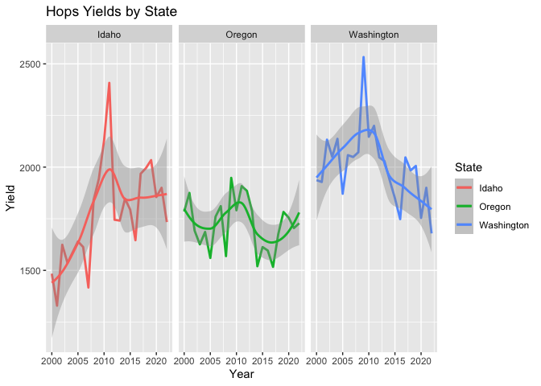
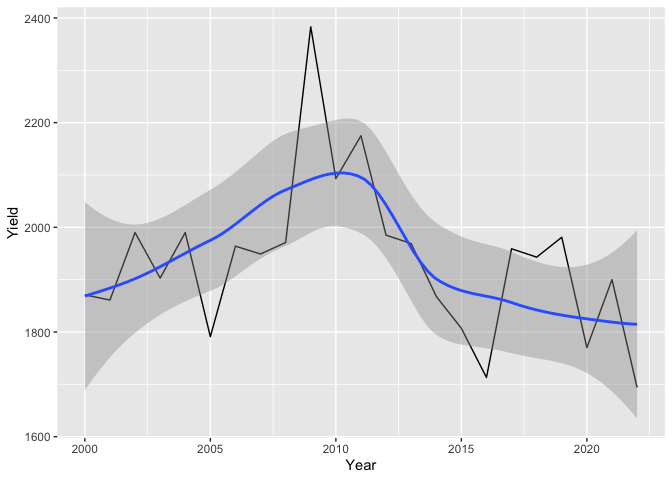
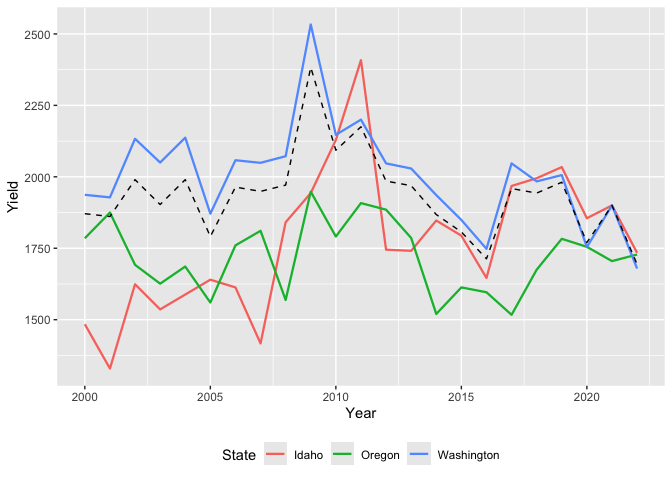
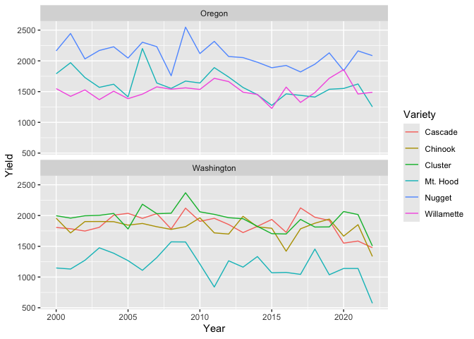

HGA data for Analysis of Hops Yield
================
Don A. Lloyd

Updated 29 August, 2025

<a name="top"></a> Keywords: hops, yields, data extraction, data
cleansing, data validation, regex, outlier analysis

[Extracting](#extracting-hop-yields-from-hga) and
[cleaning](#data-cleaning) hop yields from HGA reports

[Validating the yield data with
NASS](#validating-the-yield-data-with-nass)

[Preliminary analysis of hops
yields](#preliminary-analysis-of-hop-yield-series) and some
[challenges](#challenges-with-yield-data)

[Summary](#summary)

[Session info](#session-info-and-notes)

``` r
require(here)
require(tictoc)
require(dplyr)
require(stringr)
require(tidyr)
require(tibble)
require(pdftools)
require(ggplot2)
require(tseries)
require(data.table) # fwrite
require(keyring)
require(rnassqs) # API for validation against NASS data
```

``` r
HGA_VERBOSE = FALSE
HGA_DATA_PATH = "~/Dropbox/Data/HGA"
```

## Extracting hop yields from HGA

In 2020, wildfires caused extensive smoke damage to crop harvests in and
around Oregon’s Willamette River Valley. The smoke damage to wine grapes
were widely reported. But, I enjoy a good IPA more often than a good
pinot so I became interested in how hops harvests were impacted by the
wildfires. The number and severity of wildfires in the Willamette Valley
that year was worsened by high temperatures and dry conditions. I began
looking for hops cultivation data to understand several questions:

- Do we see evidence that hop yields negatively impacted in 2020?

- What environmental observations – if any – correlate with yields or
  changes in yields?

- Are some hops varieties or growing regions more or less susceptible to
  changes in environmental variables?

The overall strategy for conducting this analysis has been to compile
climate and air quality data for areas in the PNW that grow hops.
Sourcing and processing of environmental data, and finding hop
cultivating areas are described in other scripts.

To begin the analysis, I compiled hops yield data from statistical
reports published annually by the [Hop Growers of
America](https://usahops.org) since 2000. I wrote much of the scripting
in this document to process the reports by identifying and parsing the
yield tables from each pdf and correct transcription issues.

I then used the [National Agricultural Statistics
Service](https://nass.usda.gov) (NASS) to validate my transcription of
the data and update missing values. NASS is an excellent source of
agricultural data in the US but it lacks hops reporting by variety
before 2013. Validating against NASS was a very useful exercise for
improving data cleaning in my pdf processing.

The yield tables include annual yields by variety and state, and summary
values by state, region, and or as national measures. None of the
available yield data provide subtotals by county in which hops were
grown.

I am using the HGA yield values when first published, not most recently
published. Each HGA table also reports several prior year’s values to
indicate changes in reporting and recent trends. Values from later
reports for a given year could be used to test for changes in reporting,
for example to revise a previously published value.

This script produces three csv files reporting hops yields in three
levels of granularity: within the PNW region, by state within the PNW,
and by variety within each state. Each file reports Year, Yield, and
data Source. State and variety labels are included in the respective
files. Outlying values in each data set are identified with dummy
variables.

The script also produces a csv of validation data from NASS, and a table
of reporting continuity for varieties grown in each state.

You can download the data files from this git and get on with your own
analysis. If you choose to download the PDFs from HGA just save them in
a directory of their own and define the full `HGA_DATA_PATH`.

### PDF processing

``` r
# this relies on lots of regex to find and parse yield tables that
# appear on different pages of each annual report. there are lots of
# issues to work around in these reports including changing headers,
# misplaced labels, tables split across multiple pages, footnote markers
# embedded in labels, variable spacing of raw table data, and 
# inconsistent labeling in different reports...
# use HGA_VERBOSE=TRUE for debugging 
#
pdf.list <- dir(HGA_DATA_PATH, pattern = ".pdf", ignore.case = TRUE, full.names = TRUE)

tic() # for the curious
# read each report, find the yield table and extract it
listtbl <- lapply(pdf.list, function(x) {
  if (HGA_VERBOSE) cat(sprintf("processing %s\n", basename(x)))
  rawtext <- pdf_text(x) %>% str_split("\n")
  singlepage <- lapply(rawtext, function(x) Reduce(c, x))
  # find header lines
  hp <- grep("[[:digit:]]{4} Statistical .*", singlepage)
  hl <- grep("[[:digit:]]{4} Statistical .*", singlepage[[min(hp)]])
  # extract the reporting year
  year <- as.numeric(gsub(".*[ ]+([[:digit:]]{4}) Statistical .*", "\\1", 
                          grep("[[:digit:]]{4} Statistical .*", singlepage[[min(hp)]], value = TRUE)
  ))
  out <- NULL
  # recent reports refer to "PNW HOP YIELDS", older reports use "U.S. HOP YIELDS"...
  ii <- grep("HOP YIELDS BY STATE", singlepage, ignore.case = TRUE)
  # find page in report that includes the current yield table by variety
  toc <- grep("HOP YIELDS.*VARIETY", unlist(singlepage[ii[1]]), ignore.case = TRUE, value = TRUE)
  pptxt <- gsub(".* ([0-9\\-]+)$", "\\1", toc)
  if (grepl("\\-", pptxt)) pptxt <- unlist(strsplit(pptxt, "\\-"))
  # can test if pp is defined
  pp <- as.numeric(pptxt)
  # isolate page numbers
  pagenumtarget = "[[:space:]]{5,}([[:digit:]ivx]+).*"
  pagenum <- sapply(1:length(singlepage), function(x) {
    pagerows <- grep(pagenumtarget, singlepage[[x]])
    if (length(pagerows) >0) {
      thispage <- max(pagerows)
      gsub(pagenumtarget, "\\1", singlepage[[x]][thispage])
    }
  })
  pp <- as.numeric(match(pptxt, pagenum))
  o <- trimws(unlist(singlepage[pp]))
  # A few files will add breaks before and or after TM labels in Variety names
  # sometimes leaving a row of numbers with no leading Variety name. We look
  # for the missing data in lines immediately preceding or following each row
  # missing a hop variety.
  # let's first eliminate "Hop Grower" lines
  o <- grep("^Hop Growers", o, invert = TRUE, value = TRUE)
  # then drop rows that are at least 5 char all caps (typically state names and some headings)
  o <- grep("^[[:upper:]]{5,}$", o, invert = TRUE, value = TRUE)
  # look for rows that start with a numeric (e.g. yield) entry that are otherwise complete
  # these rows are missing a variety entry
  # this is a little cumbersome, but better than other methods I have tried...
  ifloat <- which(grepl("^[0-9,]{3,}|^TM[ ]+|^[12]{1}[ ]*", o) & nchar(o) >30)
  if (length(ifloat) >0) {
    if (HGA_VERBOSE) {
      cat("these rows appear to be missing variety labels\n")
      print(ifloat)
    }
    # check previous 2 rows for varietal label that got left behind
    for (i in ifloat) {
      if (HGA_VERBOSE) cat(sprintf("checking line %d:\n%s\n", i, o[i]))
      ivar <- c(i-2, i-1)
      # in rare cases the pdf publishing software will format the
      # variety label by shifting it up or down one row, so let's fix it
      # the logic is a little pedantic, but easy enough to read
      if (match(i, ifloat) < length(ifloat)) {
        ok <- (i+1 < ifloat[match(i, ifloat) +1] -2)
      } else {
        ok <- (i+1 < length(o))
      }
      if (ok) ivar <- c(ivar, i+1)
      if (HGA_VERBOSE) print(o[sort(c(ivar,i))])
      ii <- which(nchar(o[ivar]) <16)
      if (length(ii) >0) {
        # replace corrected line using wide space so it parses with remainder of table
        # n.b. the partial lines we built labels from won't be parsed below...
        if (HGA_VERBOSE) cat(sprintf("proposed label: %s\n", paste(o[ivar[ii]], collapse = " ")))
        o[i] <- paste(paste(o[ivar[ii]], collapse = " "), o[i], sep = "          ")
        if (HGA_VERBOSE) print(o[i])
      } else {if (HGA_VERBOSE) cat("no label text found...\n")}
    } 
  } # closes loop for missing label search
  # find rows that conform to a table definition
  rawtbl <- grep("([0-9,\\.]+|[\\*]){3,}", o, value = TRUE) %>%
    # replace blank space with a delimiter unique to the table
    gsub("[[:space:]]{2,}", "|", .) %>% 
    gsub(",|%", "", .) %>% # drop comma and percentage formatting
    # next line partially fixes issues with extra spaces or footnote labels in first col
    gsub("([[:alpha:] \\!]+)\\|([[:alpha:] ]+|[123]?\\|.*)", "\\1 \\2", .)
  tblrows <- grep("\\|", rawtbl) # keep only lines we can parse
  rawtbl <- rawtbl[tblrows]
  # find header row
  h <- grep("Variety", rawtbl, ignore.case = TRUE)
  # header may be duplicated if table continues on second page
  # find start of next table
  h1 <- min(h)
  # n.b. this header appears to be consistent across the reports
  hdr <- unlist(strsplit(rawtbl[h1], split = "\\|"))
  # if there are three or more header rows with a split table, assume
  # they mark new tables that can be dropped...
  hh <- ifelse(length(h) >2, h[3] - 1, length(rawtbl))
  rawtbl <- rawtbl[1:hh] # dropping extra rows
  # eliminate stray headers
  rawtbl <- grep("& Variety", rawtbl, ignore.case = TRUE, value = TRUE, invert = TRUE)
  # ready to parse what is left
  # read.table orig. had skip = h1, error caused us to skip several years of
  # single line Idaho reporting...
  parsedtbl <- read.table(text = rawtbl, skip = 1, sep = "|", fill = TRUE,
                          na.strings = c("*"), row.names = NULL,
                          col.names = hdr) %>%
    as_tibble %>%
    select(1, all_of(paste0("X", year))) %>%
    rename(Variety = 1, Yield = 2) %>%
    mutate(Yield = ifelse(grepl("[^[:digit:]]", Yield), NA, Yield)
           ,Yield = as.numeric(Yield)
           ,Year = year
           ,isTotal = grepl("Total", Variety)
           ,Variety = gsub("Total Idaho[ ]*1", "Total Idaho", Variety)
           ,State = ifelse(isTotal, trimws(gsub("Total", "", Variety)), NA)
           ,Source = paste("HGA", basename(x))
    ) %>%
    fill(State, .direction = "up")
  list(file = basename(x), tbl = parsedtbl, year = year, 
       raw = rawtbl, o = o)
}) # next file
toc()
```

    ## 4.272 sec elapsed

``` r
years <- unlist(lapply(listtbl, function(x) x$year))
listtbl <- setNames(listtbl, years)

# save the years of yield reporting to correctly bound
# climate and air data sets later on
fwrite(data.frame(years = sort(years)), file = here("HGA_years.csv"))
```

### Data cleaning

Cleanup on names seems self evident to me, but for background and
explanatory info see:
<https://en.wikipedia.org/wiki/List_of_hop_varieties>

For naming conventions see <https://www.hopslist.com/hops/>

Abbreviations for some of the major hop breeders:

- HBC = Hop Breeding Company, a joint venture of YCR and Haas
- VGX = Virgil Gamache Farms, Toppenish, WA
- YCR = Yakima Chief Ranches, consortium of family hop farms, Yakima, WA
- ADHA = Association for the Development of Hop Agronomy (www.adha.us)

*Some variety names are trademarked.*

``` r
# process each table, clean and parse variety names
hga_yield <- 
  lapply(listtbl, function(x) x$tbl) %>% 
  bind_rows() %>%
  filter(!str_detect(Variety, "TATE")) %>%
  # the 2012 report does not include the total rows for WA or US/PNW
  mutate(State = ifelse(is.na(State) & Year == 2012, "Washington", State)
         ,isTM = grepl("TM|T M|\\x99", Variety) # trademark
         ,isR = grepl(" R|R |\\xAE", Variety) # registered trademark
         # eliminate commas, parentheses and symbols from variety names
         ,Variety = gsub(",|\\(|\\)|TM|T M|\\x99|\\xAE|\\*", "", Variety)
         ,Variety = trimws(Variety) # clean up trailing spaces after symbol pass
         # ,Variety = gsub(",|\\(|\\)|TM|T M| R|R |\\x99|\\xAE", "", Variety)
         # contract multiple spaces
         ,Variety = gsub("[[:space:]]{2,}", " ", Variety)
         # eliminate strays spaces within variety names
         ,Variety = gsub("([[:alpha:]]+)[[:space:]]+([[:lower:]]+.*)", "\\1\\2", Variety)
         # drop subscripts from total and aggregate lines
         ,Variety = gsub("(Total|Other [A-Za-z]+)[ ]*[12]$", "\\1", Variety)
         # standardize variety names
         ,Variety = case_when(
           grepl("YCR[ ]*4|Palisade", Variety) ~ "Palisade YCR 4"
           ,grepl("YCR[ ]*5|Warrior", Variety) ~ "Warrior YCR 5"
           ,grepl("Super[ ]*Galena", Variety) ~ "Super Galena"
           ,grepl("Talus|692", Variety) ~ "Talus HBC 692"
           ,grepl("Summit", Variety) ~ "Summit"
           ,grepl("Ahtanum|YCR 1$", Variety) ~ "Ahtanum YCR 1" 
           #,grepl("Ahtanum|YCR 1[^[:digit:]]?", Variety) ~ "Ahtanum YCR 1" # under test
           ,grepl("ADHA-483|Azacca", Variety) ~ "Azacca ADHA-483"
           ,grepl("ADHA-881|Jarrylo", Variety) ~ "Jarrylo ADHA-881"
           ,grepl("Pekko|ADHA-871", Variety) ~ "Pekko ADHA-871"
           ,grepl("Citra|HBC 394", Variety) ~ "Citra HBC 394"
           ,grepl("Tettnang", Variety) ~ "Tettnanger"
           ,grepl("Loral|HBC 291", Variety) ~ "Loral HBC 291"
           ,grepl("Simcoe|YCR 14", Variety) ~ "Simcoe YCR 14"
           ,grepl("Hallertauer", Variety) ~ "Hallertau"
           ,grepl("Calyp so", Variety) ~ "Calypso" # unusual space...
           ,TRUE ~ Variety
         )
  )
# hga_yield table retains "Other" varieties and totals
(hga_varieties <- 
    hga_yield %>%
    pull(Variety) %>%
    sort %>%
    unique
)
```

    ##  [1] "Ahtanum YCR 1"           "Alpha"                  
    ##  [3] "Amarillo VGXP01"         "Apollo"                 
    ##  [5] "Aroma"                   "Azacca ADHA-483"        
    ##  [7] "Bravo"                   "Calypso"                
    ##  [9] "Cascade"                 "Cashmere"               
    ## [11] "Centennial"              "Chelan"                 
    ## [13] "Chinook"                 "Citra HBC 394"          
    ## [15] "Cluster"                 "Columbus/Tomahawk"      
    ## [17] "Columbus/Tomahawk/Zeus"  "Comet"                  
    ## [19] "Crystal"                 "Ekuanot HBC 366"        
    ## [21] "El Dorado"               "Eroica"                 
    ## [23] "Eureka!"                 "Experimental"           
    ## [25] "Fuggle"                  "Galena"                 
    ## [27] "Glacier"                 "Golding"                
    ## [29] "Hallertau"               "Hallertau Magnum"       
    ## [31] "High Alpha"              "Horizon"                
    ## [33] "Idaho 7"                 "Jarrylo ADHA-881"       
    ## [35] "Liberty"                 "Loral HBC 291"          
    ## [37] "Magnum"                  "Millennium"             
    ## [39] "Mosaic HBC 369"          "Mt. Hood"               
    ## [41] "Mt. Rainier"             "Northern Brewer"        
    ## [43] "Nugget"                  "Olympic"                
    ## [45] "Other"                   "Other Alpha"            
    ## [47] "Other Aroma"             "Other Varieties"        
    ## [49] "Pahto HBC 682"           "Palisade YCR 4"         
    ## [51] "Pekko ADHA-871"          "Perle"                  
    ## [53] "Saaz"                    "Sabro HBC 438"          
    ## [55] "Santiam"                 "Simcoe YCR 14"          
    ## [57] "Sorachi Ace"             "Sterling"               
    ## [59] "Strata OR 91331"         "Summit"                 
    ## [61] "Super Galena"            "Tahoma"                 
    ## [63] "Talus HBC 692"           "Tettnanger"             
    ## [65] "Tillicum"                "Total Idaho"            
    ## [67] "Total Oregon"            "Total Pacific Northwest"
    ## [69] "Total United States"     "Total Washington"       
    ## [71] "Triumph"                 "Vanguard"               
    ## [73] "Warrior YCR 5"           "Willamette"             
    ## [75] "Zappa"                   "Zeus"

[Back to top](#top)

## Validating the yield data with NASS

To validate, we can retrieve hops yields from the National Agriculture
Statistics Server (NASS) via its API.

``` r
key_get("NASS") %>%
  nassqs_auth()

hops_nass <- nassqs(
  source_desc = "SURVEY"
  ,sector_desc = "CROPS"
  ,commodity_desc = "HOPS"
  ,year__GE = min(years) # 20250826 updated API
  ,reference_period_desc = "YEAR"
  # ,unit_desc = "ACRES"
  ,progress_bar = FALSE
)

fwrite(hops_nass, file = "hops_nass_data.csv")

# annual yields by state per NASS
(state_errors <- 
  hops_nass %>%
  tibble() %>%
  filter(statisticcat_desc == "YIELD"
         ,class_desc == "ALL CLASSES"
         ,agg_level_desc == "STATE"
         #,year >= 2000
         ) %>%
         # clean comma delimited values and "no reporting" marker
  transmute(Yield = ifelse(grepl("\\(D\\)", Value), NA, gsub(",", "", Value))
         ,Yield = as.numeric(Yield)
         ,Year= as.numeric(year)
         ,State = paste("Total", str_to_title(state_name))
         ) %>%
  left_join(hga_yield, by = c("Year", "State"="Variety"),
            suffix = c("_HGA", "_NASS")) %>%
  select(State, Year, starts_with("Yield"), Source) %>%
  arrange(Year, State) %>%
  mutate(frac_err = Yield_HGA /Yield_NASS -1)
)
```

    ## # A tibble: 78 × 6
    ##    State             Year Yield_HGA Yield_NASS Source     frac_err
    ##    <chr>            <dbl>     <dbl>      <dbl> <chr>         <dbl>
    ##  1 Total Idaho       2000      1484       1484 HGA 22.pdf        0
    ##  2 Total Oregon      2000      1785       1785 HGA 22.pdf        0
    ##  3 Total Washington  2000      1937       1937 HGA 22.pdf        0
    ##  4 Total Idaho       2001      1329       1329 HGA 21.pdf        0
    ##  5 Total Oregon      2001      1875       1875 HGA 21.pdf        0
    ##  6 Total Washington  2001      1928       1928 HGA 21.pdf        0
    ##  7 Total Idaho       2002      1624       1624 HGA 20.pdf        0
    ##  8 Total Oregon      2002      1692       1692 HGA 20.pdf        0
    ##  9 Total Washington  2002      2133       2133 HGA 20.pdf        0
    ## 10 Total Idaho       2003      1536       1536 HGA 19.pdf        0
    ## # ℹ 68 more rows

``` r
# class_desc is variety
nass_simple <- 
  hops_nass %>%
  tibble %>%
  mutate(Year = as.numeric(year)) %>%
  filter(statisticcat_desc == "YIELD"
         ,class_desc != "ALL CLASSES"
         ,agg_level_desc == "STATE"
         #,year >= 2000
         ) %>%
  select(class_desc, Value, Year, state_name) %>%
  mutate(Yield = ifelse(grepl("\\(D\\)", Value), NA, gsub(",", "", Value))
         ,Yield = as.numeric(Yield)
         ,Variety = gsub(",| TM| R[^[:upper:]]| R$", "", class_desc)
         ,Variety = case_when(
           Variety == "MILLENIUM" ~ "MILLENNIUM" # fix persistent NASS typo
           ,grepl("MITTEL", Variety) ~ "HALLERTAU"
           ,grepl("HBC 682", Variety) ~ "PAHTO HBC 682" # NASS doesn't use Pahto name
           ,grepl("C/T/Z", Variety) ~ "COLUMBUS/TOMAHAWK" # HGA still use C/T label (16 June 24)
           ,grepl("SABROHBC 438", Variety) ~ "SABRO HBC 438" # typo (16 June 24)
           ,TRUE ~ Variety
         )
         ,State = str_to_title(state_name)
         # matching on our standardized varietal names
         ,Match = match(Variety, toupper(hga_varieties))
  ) %>%
  select(Variety, Yield, Year, State, Match) %>%
  arrange(Year, State)

# these are varieties tracked by NASS but not matched with HGA varieties.
# Some may fall into the HGA "other" or "experimental" categories as a catchall
# for new varieties are not yet established across multiple growers
nass_simple %>%
  filter(is.na(Match)) %>%
  pull(Variety) %>% 
  unique
```

    ##  [1] "HALLERTAUER MAGNUM" "BULLION"            "DELTA"             
    ##  [4] "MERIDIAN"           "STRATAOR91331"      "BITTER GOLD"       
    ##  [7] "LEMONDROP"          "LOTUS"              "SULTANA"           
    ## [10] "IDAHO GEM"          "ELANI YQH 1320"     "HELIOS HS15619"    
    ## [13] "ALTUS"              "MCKENZIE C 148"

``` r
hga_errors <- 
  left_join(
    select(hga_yield, Variety, Year, State, Yield, Source) %>%
      mutate(Match = toupper(Variety))
    ,select(nass_simple, Variety, Year, State, Yield)
    ,by = c("Match"="Variety", "Year", "State"),
    suffix = c("_HGA", "_NASS")) %>%
  filter(!is.na(Yield_NASS)) %>%
  select(State, Variety, Year, starts_with("Yield"), Source, -Match) %>%
  mutate(frac_err = Yield_HGA /Yield_NASS -1) %>%
  arrange(Year, State, Variety)

# years of NASS reporting that overlap with HGA
# (we don't have NASS reporting by variety before 2013...)
group_by(hga_errors, State) %>% 
  summarise(Start = min(Year), End = max(Year))
```

    ## # A tibble: 3 × 3
    ##   State      Start   End
    ##   <chr>      <dbl> <dbl>
    ## 1 Idaho       2013  2022
    ## 2 Oregon      2013  2022
    ## 3 Washington  2013  2022

Discrepancies between NASS and HGA are infrequent, and some are likely
rounding errors in yield computations (\< 1%.) We will keep the HGA
assignment for these:

- Chinook, OR, 2015
- El Dorado, WA, 2015

The most common source of larger discrepancies are found in 2013, the
first NASS reporting year. Its possible that NASS reporting in 2013 has
transcription errors from a new import process that were mostly
corrected in later reporting. This may be worth investigating further,
but for now I will retain the HGA values with the option of including
NASS as an alternative value for sensitivity testing later on.

``` r
filter(state_errors, frac_err >0)
```

    ## # A tibble: 6 × 6
    ##   State             Year Yield_HGA Yield_NASS Source      frac_err
    ##   <chr>            <dbl>     <dbl>      <dbl> <chr>          <dbl>
    ## 1 Total Washington  2005      1878       1871 HGA 17.pdf  0.00374 
    ## 2 Total Idaho       2012      1841       1745 HGA 10.pdf  0.0550  
    ## 3 Total Idaho       2017      1974       1968 HGA 105.pdf 0.00305 
    ## 4 Total Oregon      2017      1518       1517 HGA 105.pdf 0.000659
    ## 5 Total Washington  2021      1932       1900 HGA 405.pdf 0.0168  
    ## 6 Total Oregon      2022      1729       1728 HGA 435.pdf 0.000579

``` r
filter(hga_errors, frac_err >0)
```

    ## # A tibble: 8 × 7
    ##   State      Variety          Year Yield_HGA Yield_NASS Source      frac_err
    ##   <chr>      <chr>           <dbl>     <dbl>      <dbl> <chr>          <dbl>
    ## 1 Idaho      Bravo            2013      2635       2430 HGA 9.pdf   0.0844  
    ## 2 Idaho      Super Galena     2013      2287       2201 HGA 9.pdf   0.0391  
    ## 3 Oregon     Super Galena     2013      2557       1852 HGA 9.pdf   0.381   
    ## 4 Washington Apollo           2013      2993       2926 HGA 9.pdf   0.0229  
    ## 5 Washington Bravo            2013      3076       2860 HGA 9.pdf   0.0755  
    ## 6 Oregon     Chinook          2015      1861       1860 HGA 5.pdf   0.000538
    ## 7 Washington El Dorado        2015      2155       2154 HGA 5.pdf   0.000464
    ## 8 Idaho      Amarillo VGXP01  2019      1613       1560 HGA 273.pdf 0.0340

I found that investigating discrepancies with NASS was very instructive
for troubleshooting pdf processing errors, and surfaced some issues with
the 2013 reporting. Here I am creating from NASS a dataframe of rows
missing from HGA.

``` r
# fill in the HGA 2012 report missing WA total yield row from NASS
(missing_from_hga <- 
  hops_nass %>%
  tibble %>%
  mutate(Year = as.numeric(year)) %>%
  filter(statisticcat_desc == "YIELD"
         ,agg_level_desc == "STATE"
         ,class_desc == "ALL CLASSES" # i.e. total state yield
         ,state_name == "WASHINGTON"
         ,Year == 2012) %>%
  select(Variety = class_desc, Yield = Value, Year, State = state_name) %>%
  mutate(isTotal = TRUE
         ,Variety = "Total Washington"
         ,State = str_to_title(State)
  ) %>%
  # fill in the National yield for same year from NASS
  add_row(
    hops_nass %>%
      tibble %>%
      mutate(Year = as.numeric(year)) %>%
      filter(statisticcat_desc == "YIELD"
             ,agg_level_desc == "NATIONAL"
             ,class_desc == "ALL CLASSES" # i.e. total state yield
             ,Year == 2012) %>%
      select(Variety = class_desc, Yield = Value, Year, State = state_name) %>%
      mutate(Variety = "Total United States"
             ,State = "United States"
      )
  ) %>%
  mutate(isTotal = TRUE
         ,Yield = as.numeric(gsub(",", "", Yield))
         ,Source = "NASS"
  )
)
```

    ## # A tibble: 2 × 6
    ##   Variety             Yield  Year State         isTotal Source
    ##   <chr>               <dbl> <dbl> <chr>         <lgl>   <chr> 
    ## 1 Total Washington     2047  2012 Washington    TRUE    NASS  
    ## 2 Total United States  1985  2012 United States TRUE    NASS

The missing national and WA aggregate yields from 2012 are truly missing
from the HGA data, not merely skipped in our processing. Add the
records, label their source, and illustrate the results. We then subset
and save the yield tables into state and regional summaries, and
varietal yields by state.

``` r
yield <- add_row(hga_yield, missing_from_hga)

# we have two sets of dependent variables: yield by state and
# yield by variety and state
pnw_yields <- filter(yield, isTotal, grepl("Pacific|United", Variety)) %>%
  select(-starts_with("is"), -Variety) %>%
  mutate(State = "Pacific Northwest") %>% # standardize region name
  arrange(Year)

state_yields <- filter(yield, isTotal, !grepl("Pacific|United", Variety)) %>%
  select(-starts_with("is"), -Variety) %>%
  arrange(State, Year)

state_yields %>%
  ggplot(aes(x=Year, y=Yield, color=State)) +
  geom_line(linewidth = 1) +
  labs(title="Hops Yields by State") +
  geom_smooth(method = "loess") +
  facet_wrap(~ State)
```

    ## `geom_smooth()` using formula = 'y ~ x'

<!-- -->

``` r
var_yields <- filter(yield, !isTotal) %>%
  select(-starts_with("is")) %>%
  arrange(State, Year, Variety)
head(var_yields, n=20)
```

    ## # A tibble: 20 × 5
    ##    Variety         Yield  Year State Source    
    ##    <chr>           <dbl> <dbl> <chr> <chr>     
    ##  1 Chinook          2000  2000 Idaho HGA 22.pdf
    ##  2 Cluster          1943  2000 Idaho HGA 22.pdf
    ##  3 Galena           1815  2000 Idaho HGA 22.pdf
    ##  4 Horizon            NA  2000 Idaho HGA 22.pdf
    ##  5 Mt. Hood         2000  2000 Idaho HGA 22.pdf
    ##  6 Nugget           2000  2000 Idaho HGA 22.pdf
    ##  7 Other Varieties  1100  2000 Idaho HGA 22.pdf
    ##  8 Willamette       1534  2000 Idaho HGA 22.pdf
    ##  9 Zeus               NA  2000 Idaho HGA 22.pdf
    ## 10 Cluster          1553  2001 Idaho HGA 21.pdf
    ## 11 Galena           1492  2001 Idaho HGA 21.pdf
    ## 12 Horizon            NA  2001 Idaho HGA 21.pdf
    ## 13 Mt. Hood         1200  2001 Idaho HGA 21.pdf
    ## 14 Nugget           1500  2001 Idaho HGA 21.pdf
    ## 15 Other Varieties  1111  2001 Idaho HGA 21.pdf
    ## 16 Willamette       1077  2001 Idaho HGA 21.pdf
    ## 17 Zeus               NA  2001 Idaho HGA 21.pdf
    ## 18 Chinook            NA  2002 Idaho HGA 20.pdf
    ## 19 Cluster            NA  2002 Idaho HGA 20.pdf
    ## 20 Galena             NA  2002 Idaho HGA 20.pdf

``` r
fwrite(pnw_yields, file = "hops_pnw_yields.csv")
fwrite(state_yields, file = "hops_state_yields.csv")
fwrite(var_yields, file = "hops_variety_yields.csv")
```

[Back to top](#top)

## Preliminary analysis of hop yield series

``` r
pnw_yields %>%
  ggplot(aes(x=Year, y=Yield)) +
  geom_line() +
  geom_smooth(method = "loess")
```

    ## `geom_smooth()` using formula = 'y ~ x'

<!-- -->

Test the regional yield series for stationarity.

``` r
# unit root and stationarity tests on yields
yield_delta <- diff(pnw_yields$Yield)

# alpha <- 0.05
# Kwiatkowski-Phillips-Schmidt-Shin (KPSS) test for stationarity
# H0: is stationary; Alt: is not stationary
( kpss <- kpss.test(pnw_yields$Yield) )
```

    ## Warning in kpss.test(pnw_yields$Yield): p-value greater than printed p-value

    ## 
    ##  KPSS Test for Level Stationarity
    ## 
    ## data:  pnw_yields$Yield
    ## KPSS Level = 0.2034, Truncation lag parameter = 2, p-value = 0.1

``` r
# (kpss.rejectH0 <- kpss$p.value < alpha)

# Augmented Dickey-Fuller unit-root test
# H0: has unit root; Alt: series has root off the unit circle
# Alt hypothesis is usually equiv. to stationarity or trend stationarity
( adf <- adf.test(pnw_yields$Yield, alternative = "stationary", k=1) )
```

    ## 
    ##  Augmented Dickey-Fuller Test
    ## 
    ## data:  pnw_yields$Yield
    ## Dickey-Fuller = -1.7924, Lag order = 1, p-value = 0.6515
    ## alternative hypothesis: stationary

``` r
# (adf.rejectH0 <- adf$p.value < alpha)
```

PNW yield is not a stationary series. Let’s test for outliers. Here and
elsewhere, I’ll use very simple interquartile tests to identify
outliers. The only differences among later IQR tests from the template
shown here will be grouping data by state and or variety, and the
completeness of series.

``` r
# add a unique observation index
pnw_yields <- mutate(pnw_yields, obs = row_number())

pnw_outlier_check <- 
  pnw_yields %>%
  mutate(State = "PNW"
         ,q1 = quantile(Yield, p = 0.25)
         ,q3 = quantile(Yield, p = 0.75)
         ,iqr = q3-q1
         ,t1 = q1 - 1.5*iqr
         ,t3 = q3 + 1.5*iqr
  )  %>% 
  mutate(outlier = (Yield < t1) | (Yield > t3))

print(outliers <- filter(pnw_outlier_check, outlier) %>%
        arrange(Year)
)
```

    ## # A tibble: 2 × 11
    ##   Yield  Year State Source       obs    q1    q3   iqr    t1    t3 outlier
    ##   <dbl> <dbl> <chr> <chr>      <int> <dbl> <dbl> <dbl> <dbl> <dbl> <lgl>  
    ## 1  2383  2009 PNW   HGA 13.pdf    10 1864.  1983  118. 1687. 2161. TRUE   
    ## 2  2175  2011 PNW   HGA 11.pdf    12 1864.  1983  118. 1687. 2161. TRUE

``` r
# keep them and assign dummies
pnw_yields_ready <- pnw_yields %>%
  mutate(Outlier = ifelse(obs %in% outliers$obs, paste0("Obs_", obs), 0)) %>%
  mutate(Dummy = ifelse(is.na(Outlier), 0, 1)) %>%
  pivot_wider(names_from="Outlier", values_from="Dummy") %>%
  mutate(across(starts_with("Obs_"), function(x) replace_na(x, 0))) %>%
  rename(Outlier = `0`) %>%
  mutate(Outlier = ifelse(is.na(Outlier), TRUE, FALSE))

left_join(state_yields, rename(pnw_yields, Region=State)
          ,by = "Year"
          ,suffix = c("", ".pnw")
          ) %>%
  select(-starts_with("Source")) %>%
  mutate(Region = "PNW") %>%
  ggplot(aes(x = Year, y=Yield, color = State)) +
  geom_line(linewidth = 0.8) +
  geom_line(aes(x = Year, y = Yield.pnw), col = "black", linetype = "dashed") +
  theme(legend.position="bottom")
```

<!-- -->

The regional yield series is quite short, and varietal series are even
shorter. We don’t see convincing evidence for stationarity, so
Box-Jenkins models are not a viable starting point. The two outliers
shown above are likely difficult to model regardless of method, and I’ve
used dummy variables to isolate them later if necessary.

The PNW total yield (dashed line) follows the inflections of the
Washington yields most closely of the three states. This just means the
regional yield is weighted primarily by the larger Washington acreage
committed to hops.

### State outliers

``` r
state_yields <- mutate(state_yields, obs = row_number())

state_outlier_check <- 
  state_yields %>%
  arrange(State, Year) %>%
  mutate(q1 = quantile(Yield, p = 0.25)
         ,q3 = quantile(Yield, p = 0.75)
         ,iqr = q3-q1
         ,t1 = q1 - 1.5*iqr
         ,t3 = q3 + 1.5*iqr
         ,.by = "State"
  )  %>% # one summary row per State
  mutate(outlier = (Yield < t1) | (Yield > t3))

print(outliers <- filter(state_outlier_check, outlier))
```

    ## # A tibble: 3 × 11
    ##   Yield  Year State      Source        obs    q1    q3   iqr    t1    t3 outlier
    ##   <dbl> <dbl> <chr>      <chr>       <int> <dbl> <dbl> <dbl> <dbl> <dbl> <lgl>  
    ## 1  2408  2011 Idaho      HGA 11.pdf     12 1618. 1922.   303 1164  2376  TRUE   
    ## 2  2533  2009 Washington HGA 13.pdf     56 1914  2065    151 1688. 2292. TRUE   
    ## 3  1679  2022 Washington HGA 435.pdf    69 1914  2065    151 1688. 2292. TRUE

``` r
state_yields_ready <- state_yields %>%
  mutate(Outlier = ifelse(obs %in% outliers$obs, paste0("Obs_", obs), 0)) %>%
  mutate(Dummy = ifelse(is.na(Outlier), 0, 1)) %>%
  pivot_wider(names_from="Outlier", values_from="Dummy") %>%
  mutate(across(starts_with("Obs_"), function(x) replace_na(x, 0))) %>%
  rename(Outlier = `0`) %>%
  mutate(Outlier = ifelse(is.na(Outlier), TRUE, FALSE))
```

### Varietial preliminaries

There is a lot of variation among the run of yield data by variety.
Privacy practices prevent individual growers from being identified by
their cultivation of a unique variety. New varieties are reported by
name only after they have successfully distinguished themselves in one
of the undifferentiated categories, like experimental or “other
varieties”.

``` r
annual_yield_runs <- function(yrs) {
  # yrs the years with observed yields for a given state/variety subset
  inclusive <- seq(min(yrs), max(yrs), 1)
  obs <- length(yrs)
  longest_run <- length(inclusive)
  longest_missing <- 0
  if (length(inclusive) -length(obs) >0) {
    z <- rep(0, length(inclusive))
    z[match(yrs, inclusive)] <- 1
    run <- rle(z)
    ii <- which(run$values > 0)
    longest_run <- max(run$lengths[ii])
    jj <- which(run$values == 0)
    if (length(jj) >0) longest_missing <- max(run$lengths[jj])
  }
  tibble(start = min(yrs)
         ,end = max(yrs)
         ,obs = obs
         ,yrs = end -start +1
         ,longest_run = longest_run
         ,longest_missing = longest_missing
         )
}

n_yr <- with(var_yields, max(Year) -min(Year) +1)

var_continuity <- 
  var_yields %>%
  filter(!is.na(Yield)) %>%
  reframe(annual_yield_runs(Year), .by=c("State", "Variety")) %>%
  mutate(complete = (obs == n_yr))

fwrite(var_continuity, file = "hops_var_continuity.csv")

# select yields by year for complete obs
var_continuity %>%
  filter(complete) %>%
  select(State, Variety) %>%
  left_join(var_yields) %>%
  ggplot(aes(x = Year, y = Yield, color = Variety)) +
  geom_line() +
  facet_wrap(~State, ncol = 1)
```

    ## Joining with `by = join_by(State, Variety)`

<!-- -->

The varieties shown in the plot are the best candidates for yield
modeling but these remain very limited data sets. Mt. Hood is included,
the only variety continuously harvested in more than one state, and
which has higher yields in Oregon than in Washington.

``` r
# for this check, keep only varieties with complete reporting
variety_outlier_check <- 
  filter(var_continuity, complete) %>%
  select(State, Variety) %>%
  left_join(var_yields) %>%
  arrange(Variety, State, Year) %>%
  mutate(q1 = quantile(Yield, p = 0.25)
         ,q3 = quantile(Yield, p = 0.75)
         ,iqr = q3-q1
         ,t1 = q1 - 1.5*iqr
         ,t3 = q3 + 1.5*iqr
         ,.by = c("State", "Variety")
  )  %>% # one summary row per State & Variety
  mutate(outlier = (Yield < t1) | (Yield > t3))
```

    ## Joining with `by = join_by(State, Variety)`

``` r
filter(variety_outlier_check, outlier)
```

    ## # A tibble: 7 × 11
    ##   State      Variety    Yield  Year Source    q1    q3   iqr    t1    t3 outlier
    ##   <chr>      <chr>      <dbl> <dbl> <chr>  <dbl> <dbl> <dbl> <dbl> <dbl> <lgl>  
    ## 1 Washington Chinook     1420  2016 HGA 7… 1746. 1901   154. 1515. 2133. TRUE   
    ## 2 Washington Chinook     1335  2022 HGA 4… 1746. 1901   154. 1515. 2133. TRUE   
    ## 3 Washington Cluster     2370  2009 HGA 1… 1820  2032   212  1502  2350  TRUE   
    ## 4 Oregon     Mt. Hood    2200  2006 HGA 1… 1456. 1700   244. 1091. 2065. TRUE   
    ## 5 Washington Mt. Hood     573  2022 HGA 4… 1092  1324.  232.  743. 1673. TRUE   
    ## 6 Oregon     Willamette  1226  2015 HGA 5… 1456  1567   111  1290. 1734. TRUE   
    ## 7 Oregon     Willamette  1857  2020 HGA 3… 1456  1567   111  1290. 1734. TRUE

``` r
# can we find which varieties contribute to state outliers?
tmp <- filter(state_yields_ready, Outlier) %>%
  select(State, Year, Yield) %>%
  left_join(var_yields, by = c("State", "Year"), suffix = c(".pnw", "")) %>%
  filter(!is.na(Yield)) %>%
  mutate(`Outlier` = paste(State, Year))

filter(tmp, Yield > Yield.pnw)
```

    ## # A tibble: 21 × 7
    ##    State       Year Yield.pnw Variety                Yield Source      Outlier  
    ##    <chr>      <dbl>     <dbl> <chr>                  <dbl> <chr>       <chr>    
    ##  1 Washington  2009      2533 Chelan                  2680 HGA 13.pdf  Washingt…
    ##  2 Washington  2009      2533 Columbus/Tomahawk       2790 HGA 13.pdf  Washingt…
    ##  3 Washington  2009      2533 Palisade YCR 4          2756 HGA 13.pdf  Washingt…
    ##  4 Washington  2009      2533 Super Galena            3186 HGA 13.pdf  Washingt…
    ##  5 Washington  2009      2533 Zeus                    3387 HGA 13.pdf  Washingt…
    ##  6 Washington  2022      1679 Ahtanum YCR 1           2032 HGA 435.pdf Washingt…
    ##  7 Washington  2022      1679 Apollo                  2483 HGA 435.pdf Washingt…
    ##  8 Washington  2022      1679 Bravo                   2161 HGA 435.pdf Washingt…
    ##  9 Washington  2022      1679 Columbus/Tomahawk/Zeus  2256 HGA 435.pdf Washingt…
    ## 10 Washington  2022      1679 Ekuanot HBC 366         2153 HGA 435.pdf Washingt…
    ## # ℹ 11 more rows

``` r
# none of our complete varieties contribute to the state-level yield outliers
filter(tmp, Yield > Yield.pnw) %>%
  left_join(select(var_continuity, State, Variety, complete)
            , by = c("State", "Variety")) %>%
  filter(complete)
```

    ## # A tibble: 0 × 8
    ## # ℹ 8 variables: State <chr>, Year <dbl>, Yield.pnw <dbl>, Variety <chr>,
    ## #   Yield <dbl>, Source <chr>, Outlier <chr>, complete <lgl>

### Challenges with yield data

For climatic and environmental analysis, For varietal analysis, hop
yields can be more useful than acres harvested or tons produced. Unlike
acreage, yield is a measure of areal density that, assuming efficient
cultivation, removes demand or popularity of a variety from the
analysis. But, hop yields are not always straightforward to interpret in
modeling or other analysis.

1.  *There is a practical upper limit to the yield that is unknown from
    these data.* There is a limit to how many plants can be cultivated
    per acre from the space each plant needs to grow, and possibly the
    preferred spacing between plants to facilitate harvest. The number
    of cones produced per bine may vary naturally by hop variety.

2.  *Efficiency of production is unknown.* Comparing yields across
    varieties or growing years assumes that their differences are due to
    natural variations, but independent of (unknowable to us)
    operational efficiency factors such as plant spacing, soil
    conditioning, or irrigation amounts. We have to assume for this
    analysis that each hop acre is cultivated as efficiently as any
    other regardless of variety or environment.

3.  *The definition of yield is uncertain.* Hop varieties are often
    selected for the particular alpha-acid content for brewing as a
    proportion of the gross weight of the harvest. So alpha yield will
    differ from gross yield by chemical compounds sensitive to variety
    and likely cultivation practices. Another question is whether yields
    are what was harvested or what is commercially viable. To understand
    environmental impacts, we might design different analyses for
    different yield targets. This won’t affect analysis of gross
    harvests, but should be kept in mind when reviewing yield analysis
    in the literature.

## Summary

We now have multiple, short time-series to analyze at region and state
levels. We also have more granular series by variety within Washington
and Oregon, some of which are complete relative to state and region
aggregates.

- Most of these series are more complete than those obtained through
  NASS and are validated for years our sources overlap in reporting.
- Most yield series are much shorter than our handful of complete Oregon
  and Washington varieties, limiting our options in what is already
  expected to be a challenging analysis. Idaho has *no* complete yield
  series for any variety since 2000.
- Validation gives credibility to early sequences in the HGA series that
  could not be tested against NASS.

[Back to top](#top)

## Session info and notes

``` r
sessionInfo()
```

    ## R version 4.4.3 (2025-02-28)
    ## Platform: aarch64-apple-darwin20
    ## Running under: macOS Monterey 12.7.6
    ## 
    ## Matrix products: default
    ## BLAS:   /Library/Frameworks/R.framework/Versions/4.4-arm64/Resources/lib/libRblas.0.dylib 
    ## LAPACK: /Library/Frameworks/R.framework/Versions/4.4-arm64/Resources/lib/libRlapack.dylib;  LAPACK version 3.12.0
    ## 
    ## locale:
    ## [1] en_US.UTF-8/en_US.UTF-8/en_US.UTF-8/C/en_US.UTF-8/en_US.UTF-8
    ## 
    ## time zone: America/Los_Angeles
    ## tzcode source: internal
    ## 
    ## attached base packages:
    ## [1] stats     graphics  grDevices utils     datasets  methods   base     
    ## 
    ## other attached packages:
    ##  [1] rnassqs_0.6.3     keyring_1.4.1     data.table_1.17.8 tseries_0.10-58  
    ##  [5] ggplot2_3.5.2     pdftools_3.5.0    tibble_3.3.0      tidyr_1.3.1      
    ##  [9] stringr_1.5.1     dplyr_1.1.4       tictoc_1.2.1      here_1.0.1       
    ## 
    ## loaded via a namespace (and not attached):
    ##  [1] utf8_1.2.6         generics_0.1.4     stringi_1.8.7      lattice_0.22-6    
    ##  [5] digest_0.6.37      magrittr_2.0.3     evaluate_1.0.4     grid_4.4.3        
    ##  [9] RColorBrewer_1.1-3 fastmap_1.2.0      Matrix_1.7-2       rprojroot_2.1.0   
    ## [13] mgcv_1.9-1         httr_1.4.7         purrr_1.1.0        scales_1.4.0      
    ## [17] cli_3.6.5          rlang_1.1.6        splines_4.4.3      withr_3.0.2       
    ## [21] yaml_2.3.10        tools_4.4.3        curl_6.4.0         vctrs_0.6.5       
    ## [25] R6_2.6.1           zoo_1.8-14         lifecycle_1.0.4    pkgconfig_2.0.3   
    ## [29] pillar_1.11.0      gtable_0.3.6       glue_1.8.0         quantmod_0.4.28   
    ## [33] Rcpp_1.1.0         xfun_0.52          tidyselect_1.2.1   rstudioapi_0.17.1 
    ## [37] knitr_1.50         farver_2.1.2       nlme_3.1-167       htmltools_0.5.8.1 
    ## [41] labeling_0.4.3     rmarkdown_2.29     xts_0.14.1         qpdf_1.4.1        
    ## [45] compiler_4.4.3     quadprog_1.5-8     TTR_0.24.4         askpass_1.2.1

### To Do

Harvest amounts and acreage are reported in other tables in HGA reports
or NASS data sets, but for this analysis I am not verifying the yield
amounts. Because yield is a ratio of amount harvested to unit area,
yields aggregated by state cannot be used to verify PNW regionwide
yield.

Write up comments on the unusually large discrepancies between HGA and
NASS for some 2013 HGA reporting, and include an alternative yield
series that replaces discrepant HGA values for NASS.

<!-- how is yield defined, by amount harvested (good or bad), sellable amount harvested, or something else? -->
